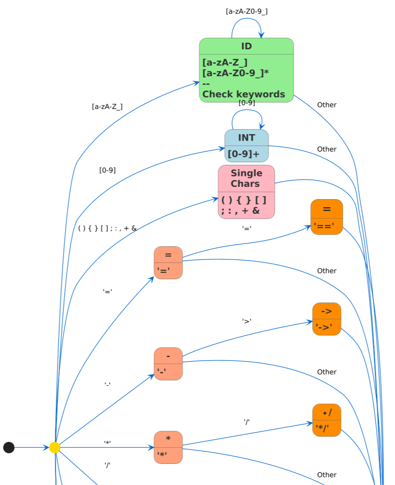
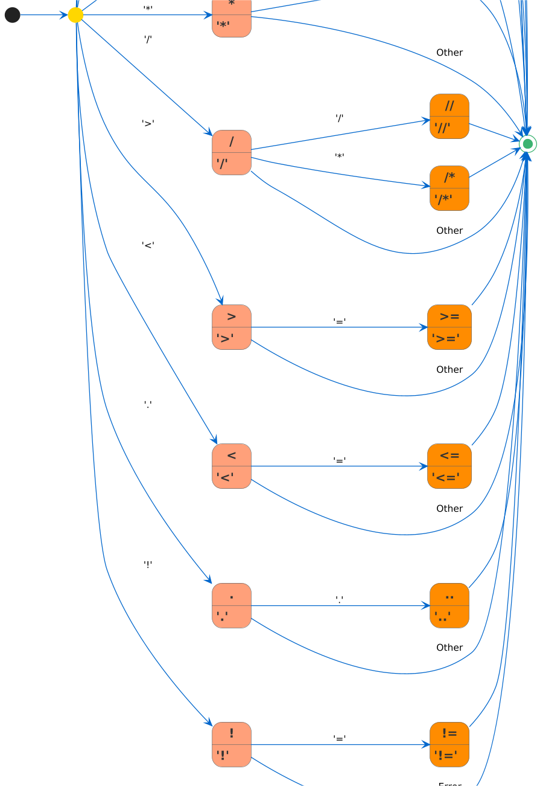

<head>
  <meta charset="UTF-8">
  <title>AI Content</title>
  <link rel="stylesheet" href="styles.css"> <!-- 修正后的引入外部CSS文件方式 -->
</head>

# Compiler Principle Project 1

## 1 总述

### 1.1 项目介绍

本项目使用 C++ 实现一个类 Rust 语言的词法和语法分析器.

基本功能是对输入的类Rust程序实现词法和语法分析,并输出若干文件体现分析结果,采用 `<type: , value: >` 形式展示词法分析后的 Token 序列,采用 AST 树的形式展示语法分析结果.

本次**实现功能**已经**超出**基本要求,从1.1 - 9.2 所有要求都已经实现;对于后续拓展功能的某些**羁绊**，因涉及到符号表内容暂未处理.

### 1.2 代码风格约定

为保证高效分工,小组有明确的代码规范：

1. 尽量编写 `pure function`,而不是 `non-pure function`,即函数尽量不要有副作用 (`side effects`)
2. 所有动态申请的资源使用 `std::unique_ptr<>` or `std::shared_ptr<>` 管理
3. 接口和实现分离,即头文件中只给出 function signature,在源文件中定义
   - 内联函数在头文件中定义
4. 使用 `namespace` 管理命名空间,避免命名污染
5. 命名规则
   - 函数名：小驼峰命名法
   - 类型名：大驼峰命名法
   - 文件名和变量名：蛇形命名法
6. 尽量编写单入口单出口函数
7. 错误处理健全
   - 善用 `assert`、`exception` 等
8. 编写一定的测试用例

### 1.3 文件组织架构说明

```shell
.
├── build            # 目标文件目录
├── docs             # 参考资料
│   ├── allstar.pdf  # Adaptive LL(*) Algorithm
│   ├── maximal_munch.pdf
│   └── 【Rust版】大作业1：词法和语法分析工具设计与实现.pdf
├── note           # 设计文档及笔记
│   └── parser.md  # 语法分析器相关设计文档
├── Makefile       # 构建文件
├── README.md      # this file
├── src            # 源代码
│   ├── ast.cpp
│   ├── include                # 头文件
│   │   ├── ast.hpp            # Abstract Syntax Tree
│   │   ├── keyword_table.hpp  # Keyword Table
│   │   ├── lexer.hpp          # Lexer
│   │   ├── parser.hpp         # Parser
│   │   ├── preproc.hpp        # Preprocess
│   │   ├── token.hpp          # Token
│   │   ├── token_type.hpp     # Token Type
│   │   ├── toy_lexer.hpp      # Toy Lexer
│   │   └── utils.hpp          # Utilities
│   ├── main.cpp
│   ├── parser.cpp
│   ├── preproc.cpp
│   ├── token.cpp
│   ├── token_type.cpp
│   ├── toy_lexer.cpp
│   └── utils.cpp
└── test
    │── build      # 目标文件目录
    ├── Makefile   # 测试用例构建文件
    ├── test_case# 用于词法和语法分析器的测试用例（一组用类 Rust 词法和语法编写的程序）
    └── *.cpp      # 模块测试用例
```

## 2 总体设计

### 2.1 系统架构

本项目当前共有以下模块:

- 核心驱动模块**main**:
  - 处理命令行参数
  - 协调各模块执行流程
  - 管理输入输出
- 词法分析模块**Lexer**:
  - 将源代码转换为Token序列
  - 管理关键字表
  - 跟踪Token位置
  - 实现最大匹配算法和有限自动机
- 语法分析模块**Parser**:
  - 递归下降LL(2)分析
  - 包含文法规则实现和错误处理
  - 构建抽象语法树节点

- 语法树展示模块**AST**:
  - 定义语法树节点结构
  - 支持语法树遍历和操作
  - 提供树形结构可视化功能

### 2.2 工作流程

1. `main()`函数接收命令行参数,根据参数确认输入文件 `in_file` 和输出文件 `output.token` & `output.dot`,实例化词法分析器 lexer 和语法分析器 parser.

2. `lexer`初始化一个`keyword_table` 来记录需要识别的关键词,`lexer::nextToken()`解析后续字符串,首先通过正则表达式识别 INT 和 ID 两类文法,在ID中识别各种关键词和保留字,在非 ID 和 INT 字符串中接着依次识别各种符号.

3. `parser`实现了`advance & match & check & checkAhead & expect`等工具对词法分析后的token进行匹配、检查、向前检查等操作,并从`parseProgram()` 开始对所有的非终结符节点进行递归下降分析.

4. `ast`根据parser的分析结果,将各个结点采用dot形式绘制出语法树.

## 3 词法分析详细设计

### 3.1 词法单元Token设计

#### 3.1.1 Token 数据结构设计

Token 数据结构如下,数据成员有type和value,除关键词声明声明外,主要包含若干构造函数和运算符重载.

```cpp
class Token {
public:
    // 关键字
    static const Token END; // end of file
    static const Token IF;
    static const Token FN;
    static const Token IN;
    static const Token I32;
    static const Token LET;
    static const Token FOR;
    static const Token MUT;
    static const Token ELSE;
    static const Token LOOP;
    static const Token BREAK;
    static const Token WHILE;
    static const Token RETURN;
    static const Token CONTINUE;

public:
    Token() : type(Type::DEFAULT), value("") {}
    Token(Type type, std::string value) : type(type), value(value) {}
    Token(const Token& other) : type(other.type), value(other.value) {}
    Token(Token&& other) : type(std::move(other.type)), value(std::move(other.value)) {}
    ~Token() = default;
    Token& operator=(const Token& rhs) = default;
    bool operator==(const Token& rhs) {
        return this->type == rhs.type && this->value == rhs.value;
    }
public:
    inline const std::string& getValue() const {
        return this->value;
    }
    inline const Type getType() const {
        return this->type;
    }
    const std::string toString() const;

private:
    Type        type;  // token type
    std::string value; // 组成 token 的字符串
};
```

#### 3.1.2 Token 类型枚举定义

```cpp
// token 类型
enum class Type {
    DEFAULT, // 默认值，无意义

    // Group 0
    END, // end of file

    // Group 1
    ID, INT, // identifier, integer
    IF, ELSE,
    WHILE, FOR,
    I32,
    LET,
    RETURN,
    MUT,
    FN,
    IN,
    LOOP,
    BREAK, CONTINUE,

    Ref,        //  &
    LPAREN,     //  (
    RPAREN,     //  )
    LBRACE,     //  {
    RBRACE,     //  }
    LBRACK,     //  [
    RBRACK,     //  ]
    SEMICOLON,  //  ;
    COLON,      //  :
    COMMA,      //  ,

    OP_PLUS,    //  +

    // Group 2
    ASSIGN,     //  =
    OP_MINUS,   //  -
    OP_MUL,     //  *
    OP_DIV,     //  /
    OP_GT,      //  >
    OP_LT,      //  <
    DOT,        //  .

    OP_EQ,      //  ==
    OP_NEQ,     //  !=
    OP_GE,      //  >=
    OP_LE,      //  <=
    DOTS,       //  ..
    ARROW,      //  ->
    SIN_COM,    //  //
    LMUL_COM,   //  /*
    RMUL_COM    //  */
};
```

### 3.2 词法分析器Lexer实现

#### 3.2.1 关键字表实现

关键字表包含一个unordered_map哈希表结构,外部可以通过传入name获得对应的Token,这里的Token是 **class Token**中已经定义好的关键字.

```cpp
/**
 * @brief   关键字表
 * @details 内置一个存储所有关键字的 hash map，用于查找判断指定 token 是否为关键字
 */
class KeywordTable {
public:
    KeywordTable()  = default;
    ~KeywordTable() = default;

public:
    inline bool iskeyword(std::string value) const {
        return (keywords.find(value) != keywords.end());
    }

    inline token::Token getKeyword(std::string value) const {
        assert(keywords.find(value) != keywords.end());
        return keywords.find(value)->second;
    }

    inline void addKeyword(std::string name, token::Token token) {
        this->keywords.emplace(name, token);
    }

private:
    std::unordered_map<std::string, token::Token> keywords; // keyword hash map
};

```

Lexer在初始化是生成关键词表,供后续词法分析使用.

```cpp
void ToyLexer::initKeywordTable(void) {
    using token::Token;
    keyword_table.addKeyword("if",       Token::IF);
    keyword_table.addKeyword("fn",       Token::FN);
    keyword_table.addKeyword("in",       Token::IN);
    keyword_table.addKeyword("i32",      Token::I32);
    keyword_table.addKeyword("let",      Token::LET);
    keyword_table.addKeyword("mut",      Token::MUT);
    keyword_table.addKeyword("for",      Token::FOR);
    keyword_table.addKeyword("loop",     Token::LOOP);
    keyword_table.addKeyword("else",     Token::ELSE);
    keyword_table.addKeyword("break",    Token::BREAK);
    keyword_table.addKeyword("while",    Token::WHILE);
    keyword_table.addKeyword("return",   Token::RETURN);
    keyword_table.addKeyword("continue", Token::CONTINUE);
}
```

#### 3.2.2 有限自动机设计





#### 3.2.3有限自动机实现

step 1: 采用std::regex库使用正则表达式匹配INT和ID类.  

```cpp
    static const std::vector<std::pair<token::Type, std::regex>> patterns {
        {token::Type::ID,  std::regex{R"(^[a-zA-Z_]\w*)"}},
        {token::Type::INT, std::regex{R"(^\d+)"}}
    };
```

step 2: 若匹配到ID,检查是否为关键词.

```cpp
    std::string view {this->text.substr(this->pos)};
    for (const auto& [type, expression] : patterns) {
        std::smatch match;
        if (std::regex_search(view, match, expression)) {
            this->pos += match.length(0);
            if (type == token::Type::ID && this->keyword_table.iskeyword(match.str(0))) {
                return this->keyword_table.getKeyword(match.str(0));
            }
            return Token{type, match.str(0)};
        }
    }
```

step 3: 依次匹配剩余符号,包括单字符和双字符组合,优先匹配双字符.

```cpp
    Token token       {};        // 识别到的词法单元
    char  first_char  {view[0]}; // 当前看到的第一个字符
    char  second_char {};        // 当前看到的第二个字符 - 用于 lookahead
    if(this->text.length() - this->pos > 1) {
        second_char = view[1];
    }

    // 检测算符和标点符号
    switch (first_char) {
    default:
        break;
    case '(':
        token = Token{token::Type::LPAREN, std::string{"("}};
        break;
    case ')':
        token = Token{token::Type::RPAREN, std::string{")"}};
        break;
    case '{':
        token = Token{token::Type::LBRACE, std::string{"{"}};
        break;
    case '}':
        token = Token{token::Type::RBRACE, std::string{"}"}};
        break;
    case '[':
        token = Token{token::Type::LBRACK, std::string{"["}};
        break;
    case ']':
        token = Token{token::Type::RBRACK, std::string{"]"}};
        break;
    case ';':
        token = Token{token::Type::SEMICOLON, std::string{";"}};
        break;
    case ':':
        token = Token{token::Type::COLON, std::string{":"}};
        break;
    case ',':
        token = Token{token::Type::COMMA, std::string{","}};
        break;
    case '+':
        token = Token{token::Type::OP_PLUS, std::string{"+"}};
        break;
    case '=':
        if (second_char == '='){
            token = Token{token::Type::OP_EQ, std::string{"=="}};
        } else {
            token = Token{token::Type::ASSIGN, std::string{"="}};
        }
        break;
    case '-':
        if (second_char == '>'){
            token = Token{token::Type::ARROW, std::string{"->"}};
        } else {
            token = Token{token::Type::OP_MINUS, std::string{"-"}};
        }
        break;
    case '*':
        if (second_char == '/'){
            token = Token{token::Type::RMUL_COM, std::string{"*/"}};
        } else {
            token = Token{token::Type::OP_MUL, std::string{"*"}};
        }
        break;
    case '/':
        if (second_char == '/'){
            token = Token{token::Type::SIN_COM, std::string{"//"}};
        } else if (second_char == '*'){
            token = Token{token::Type::LMUL_COM, std::string{"/*"}};
        } else {
            token = Token{token::Type::OP_DIV, std::string{"/"}};
        }
        break;
    case '>':
        if (second_char == '=') {
            token = Token{token::Type::OP_GE, std::string{">="}};
        } else {
            token = Token{token::Type::OP_GT, std::string{">"}};
        }
        break;
    case '<':
        if (second_char == '='){
            token = Token{token::Type::OP_LE, std::string{"<="}};
        } else {
            token = Token{token::Type::OP_LT, std::string{"<"}};
        }
        break;
    case '.':
        if(second_char == '.'){
            token = Token{token::Type::DOTS, std::string{".."}};
        } else{
            token = Token{token::Type::DOT, std::string{"."}};
        }
        break;
    case '!':
        if(second_char == '='){
            token = Token{token::Type::OP_NEQ, std::string{"!="}};
        }
        break;
    case '&':
        token = Token{token::Type::Ref, std::string{"&"}};
        break;
    }

    if (!token.getValue().empty()) {
        this->pos += token.getValue().length();
        return token;
    }

    return std::nullopt; // 识别到未知 token
```

#### 3.2.4 位置信息跟踪

### 3.3 词法错误处理

## 4 语法分析详细设计

### 4.1 文法设计

#### 4.1.1 类RUST语言的文法定义

采用LL(2)兼容的上下文无关文法（CFG），核心规则如下：

```shell
Prog        → Decl*
Decl        → FuncDecl
FuncDecl    → "fn" ID "(" Args ")" ("->" VarType)? BlockStmt
Args        → (Arg ("," Arg)*)?
Arg         → ("mut")? ID ":" VarType
BlockStmt   → "{" Stmt* "}"
Stmt        → VarDeclStmt | AssignStmt | IfStmt | WhileStmt | ...
Expr        → FuncExprBlockStmt | IfExpr | LoopStmt | CmpExpr
```

实际实现的产生式如下：

```shell
- Prog -> (FuncDecl)*
- FuncDecl -> FuncHeaderDecl BlockStmt
- BlockStmt -> FuncExprBlockStmt
- FuncHeaderDecl -> "fn" "\<ID\>" "(" (arg ("," arg)*)? ")" ("->" VarType)?
- arg -> VarDeclBody ":" VarType
- VarDeclBody -> ("mut")? "\<ID\>"
- VarType -> (["&" | "&" "mut"])? [Integer | Array | Tuple]
- Integer -> "i32"
- Array -> "[" VarType ";" "\<INT\>" "]"
- Tuple -> "(" (VarType ",")+ (VarType)? ")"
- BlockStmt -> "{" (Stmt)* "}"
- FuncExprBlockStmt -> "{" (Stmt)* Expr "}"
- Stmt -> VarDeclStmt | RetStmt | CallExpr | AssignStmt | ExprStmt | IfStmt | WhileStmt | ForStmt | LoopStmt | BreakStmt | ContinueStmt | NullStmt
- VarDeclStmt -> "let" ("mut")? "\<ID\>" (":" VarType)? ("=" Expr)? ";"
- RetStmt -> "return" (CmpExpr)? ";"
- CallExpr -> "\<ID\>" "(" (arg ("," arg)*)? ")"
- AssignStmt -> AssignElement "=" Expr ";"
- AssignElement -> Deference | ArrayAccess | TupleAccess | Variable
- Deference -> "*" "\<ID\>"
- ArrayAccess -> "\<ID\>" "[" Expr "]"
- TupleAccess -> "\<ID\>" "." "\<INT\>"
- Variable -> "\<ID\>"
- ExprStmt -> Expr ";"
- IfStmt -> "if" CmpExpr BlockStmt (ElseClause)*
- ElseClause -> "else" ("if" Expr)? BlockStmt
- WhileStmt -> "while" CmpExpr BlockStmt
- ForStmt -> "for" VarDeclBody "in" CmpExpr ".." CmpExpr BlockStmt
- LoopStmt -> "loop" BlockStmt
- BreakStmt -> "break" (Expr)? ";"
- ContinueStmt -> "continue" ";"
- NullStmt -> ";"
- Expr -> FuncExprBlockStmt | IfExpr | loopExpr | CmpExpr
- CmpExpr -> AddExpr ([\< | \<= | \> | \>= | == | !=] AddExpr)*
- AddExpr -> MulExpr ([+ | -] MulExpr)*
- MulExpr -> Factor ([\* | /] Factor)*
- Factor -> ArrayElements | TupleElements | (["&" | "&" "mut"])? Element | ParenthesisExpr
- ArrayElements -> "[" Expr ("," Expr)* "]"
- TupleElements -> "(" (Expr ",")+ (Expr)? ")"
- Element -> ParenthesisExpr | "\<INT\>" | AssignElement | CallExpr | Variable
- ParenthesisExpr -> "(" CmpExpr ")"
- IfExpr -> "if" Expr FuncExprBlockStmt "else" FuncExprBlockStmt
```

#### 4.1.2 消除左递归

产生式左递归主要出现在Expr相关内容：

```shell
**3.2 表达式增加计算和比较（前置规则 3.1）**:

- Expr -> Expr [\< | \<= | \> | \>= | == | !=] AddExpr
- AddExpr -> AddExpr [+ | -] Item
- Item -> Item [\* | /] Factor
```

我们采用分层处理优先级方法实现Expr并消除左递归：

```shell
- Expr -> FuncExprBlockStmt | IfExpr | loopExpr | CmpExpr
- CmpExpr -> AddExpr ([\< | \<= | \> | \>= | == | !=] AddExpr)*
- AddExpr -> MulExpr ([+ | -] MulExpr)*
- MulExpr -> Factor ([\* | /] Factor)*
- Factor -> ArrayElements | TupleElements | (["&" | "&" "mut"])? Element | ParenthesisExpr
```

#### 4.1.3 通过vector实现右递归减少递归层数

以`Args → (Arg ("," Arg)*)?`为例,采用vector来代替右递归.

```cpp
    std::vector<ast::ArgPtr> argv {};
    while(!check(TokenType::RPAREN)) {
        argv.push_back(parseArg());
        if (!check(TokenType::COMMA)) {
            break;
        }
        advance();
    }
```

### 4.2 语法分析器Parser实现

#### 4.2.1 Token流管理

```cpp
class Parser {
private:
    void advance();
    bool match(lexer::token::Type type);
    bool check(lexer::token::Type type) const;
    bool checkAhead(lexer::token::Type type);
    void expect(lexer::token::Type type, const std::string& error_msg);

private:
    std::function<std::optional<lexer::token::Token>()> nextTokenFunc; // 获取下一个 token
    std::optional<lexer::token::Token>                  current;       // 当前看到的 token
    std::optional<lexer::token::Token>                  lookahead;     // 往后看一个 token
};
```

采用**三明治模型**管理Token:

- current 表示当前token
- lookahead 表示预读token
- nextTokenFunc 接收lexer::nextToken()

主要方法有:
advance,match,check,checkAhead,expect,这些方法为词法分析提供必要功能,详见下面注释与代码:

```cpp
/**
 * @brief 向前扫描一个 token
 */
void Parser::advance() {
    if (lookahead.has_value()) {
        current = lookahead;
        lookahead.reset(); // 清除 lookahead 中的值
    } else {
        current = nextTokenFunc();
    }
}

/**
 * @brief  匹配当前 token，并向前扫描一个 token
 * @param  type 需匹配的 token 类型
 * @return 是否成功匹配
 */
bool Parser::match(lexer::token::Type type) {
    if (check(type)) {
        advance();
        return true;
    }
    return false;
}

/**
 * @brief  检查当前看到的 token 是否存在，如果存在判断其类型是否为给定值
 * @param  type 指定的 token 类型
 * @return 是否通过检查
 */
bool Parser::check(lexer::token::Type type) const {
    return current.has_value() && current.value().getType() == type;
}

/**
 * @brief  向前检查一个 token，判断其类型是否为给定值
 * @param  type 指定的 token 类型
 * @return 是否通过检查
 */
bool Parser::checkAhead(lexer::token::Type type) {
    if (!lookahead.has_value()) {
        lookahead = nextTokenFunc(); // 获取下一个 token
    }
    return lookahead.has_value() && lookahead->getType() == type;
}

/**
 * @brief 匹配期望的 token，如果未匹配成功则抛出 runtime error
 * @param type      期望的 token 类型
 * @param error_msg 错误信息
 */
void Parser::expect(lexer::token::Type type, const std::string& error_msg) {
    if (!match(type)) {
        throw std::runtime_error{error_msg};
    }
}
```

#### 4.2.2 LL(2)解析器设计

##### 递归下降解析

对于每个非终结符,都有对应的解析函数.

```cpp
public:
    ast::ProgPtr parseProgram();
private:
    ast::FuncDeclPtr          parseFuncDecl();
    ast::FuncHeaderDeclPtr    parseFuncHeaderDecl();
    ast::NodePtr              parseStmtOrExpr();
    ast::BlockStmtPtr         parseBlockStmt();
    ast::RetStmtPtr           parseRetStmt();
    ast::ArgPtr               parseArg();
    ast::VarDeclStmtPtr       parseVarDeclStmt();
    ast::AssignStmtPtr        parseAssignStmt(ast::AssignElementPtr&& lvalue);
    ast::AssignElementPtr     parseAssignElement();
    ast::ExprPtr              parseExpr(std::optional<ast::AssignElementPtr> elem = std::nullopt);
    ast::ExprPtr              parseCmpExpr(std::optional<ast::AssignElementPtr> elem = std::nullopt);
    ast::ExprPtr              parseAddExpr(std::optional<ast::AssignElementPtr> elem = std::nullopt);
    ast::ExprPtr              parseMulExpr(std::optional<ast::AssignElementPtr> elem = std::nullopt);
    ast::ExprPtr              parseFactor(std::optional<ast::AssignElementPtr> elem = std::nullopt);
    ast::ExprPtr              parseElementExpr(std::optional<ast::AssignElementPtr> elem = std::nullopt);
    ast::CallExprPtr          parseCallExpr();
    ast::IfStmtPtr            parseIfStmt();
    ast::ElseClausePtr        parseElseClause();
    ast::WhileStmtPtr         parseWhileStmt();
    ast::ForStmtPtr           parseForStmt();
    ast::LoopStmtPtr          parseLoopStmt();
    ast::VarTypePtr           parseVarType();
    ast::FuncExprBlockStmtPtr parseFuncExprBlockStmt();
    ast::IfExprPtr            parseIfExpr();
    ast::BreakStmtPtr         parseBreakStmt();
```

每个函数的返回值都是AST结点,每个非终结符都有各自的解析函数,顶层是`parseProgram()`外部调用,由此逐层向下递归分析整个程序.

##### 解析函数示例

由于这些函数比较复杂,所以只展示几个代表性函数的实现.

```cpp
/**
 * @brief  解析函数头声明
 * @return ast::FuncHeaderDeclPtr - AST Function Header Declaration 结点指针
 */
[[nodiscard]]
ast::FuncHeaderDeclPtr Parser::parseFuncHeaderDecl() {
    // FuncHeaderDecl -> fn <ID> ( <args> )
    using TokenType = lexer::token::Type;

    expect(TokenType::FN, "Expected 'fn'");

    expect(TokenType::ID, "Expected function name");
    std::string name = current->getValue(); // function name

    expect(TokenType::LPAREN, "Expected '('");

    std::vector<ast::ArgPtr> argv {};
    while(!check(TokenType::RPAREN)) {
        argv.push_back(parseArg());
        if (!check(TokenType::COMMA)) {
            break;
        }
        advance();
    }

    expect(TokenType::RPAREN, "Expected ')'");

    if (check(TokenType::ARROW)) {
        expect(TokenType::ARROW, "Expected '->'");
        auto type = parseVarType();
        return std::make_shared<ast::FuncHeaderDecl>(std::move(name), std::move(argv), std::move(type));
    }
    return std::make_shared<ast::FuncHeaderDecl>(std::move(name), std::move(argv), std::nullopt);
}
```

`Parser::parseFuncHeaderDecl()`实现的就是函数头对应`FuncHeaderDecl -> fn <ID> ( Args )`和`FuncHeaderDecl -> fn <ID> ( Args ) -> VarType` 两条产生,该函数可以体现出解析器的实现特点：

1. 充分利用具有错误提示的`expect`来实现 Token 匹配.
2. `advance()`通常与 if/while (check()) 结合使用,来实现一个非终结符多条产生式的不同分支情况,来实现LL(1).
3. 对于右递归,如 Args 的解析,就会充分使用std::vector来操作.


```cpp
/**
 * @brief  解析语句或表达式
 * @return ast::NodePtr - Stmt 或 Expr 结点指针
 */
[[nodiscard]]
ast::NodePtr Parser::parseStmtOrExpr() {
    using TokenType = lexer::token::Type;

    ast::StmtPtr stmt {};
    if (check(TokenType::LET)) {
        stmt = parseVarDeclStmt();
    } else if (check(TokenType::RETURN)) {
        stmt = parseRetStmt();
    } else if (check(TokenType::ID) || check(TokenType::OP_MUL)) {
        if (check(TokenType::ID) && checkAhead(TokenType::LPAREN)) {
            return parseCallExpr();
        }
        /*
         * x, *x, x[idx], x.idx 都即可以作为赋值语句的左值，又可以作为表达式的一个操作数
         */
        auto elem = parseAssignElement();
        if (check(TokenType::ASSIGN)) {
            stmt =  parseAssignStmt(std::move(elem));
        } else {
            return parseExpr(elem);
        }
    } else if (check(TokenType::INT) || check(TokenType::LPAREN)) {
        return parseExpr();
    } else if (check(TokenType::IF)) {
        stmt = parseIfStmt();
    } else if (check(TokenType::WHILE)) {
        stmt = parseWhileStmt();
    } else if (check(TokenType::FOR)) {
        stmt = parseForStmt();
    } else if (check(TokenType::LOOP)) {
        stmt = parseLoopStmt();
    } else if (check(TokenType::BREAK)) {
        stmt = parseBreakStmt();
    } else if (check(TokenType::CONTINUE)) {
        stmt = std::make_shared<ast::ContinueStmt>();
        advance();
        expect(TokenType::SEMICOLON,"Expected ';' after Continue");
    } else if (check(TokenType::SEMICOLON)){
        stmt = std::make_shared<ast::NullStmt>();
        advance();
    }

    return stmt;
}
```

`Parser::parseStmtOrExpr()`是整个语法分析器中非常重要的函数,因为单个Statement是程序中最复杂的单位,需要充分的前向搜索来确定下一步调用的是哪个解析函数,而这里就使用了checkAhead来实现LL(2).

### 4.3 语法错误处理

## 5 AST详细设计

### 5.1 AST节点设计

### 5.2 AST构建

### 5.3 AST可视化

## 6 测试与验证

## 7 总结与展望
