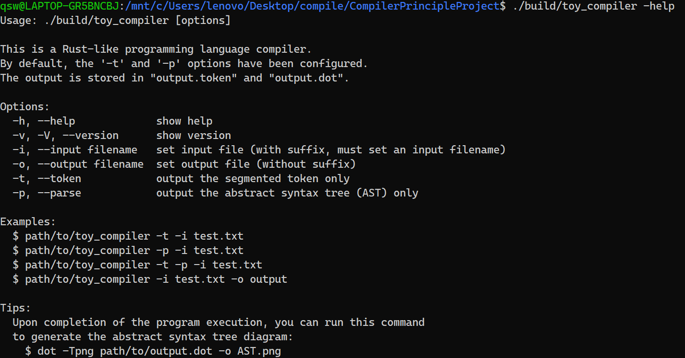
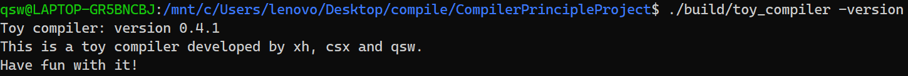
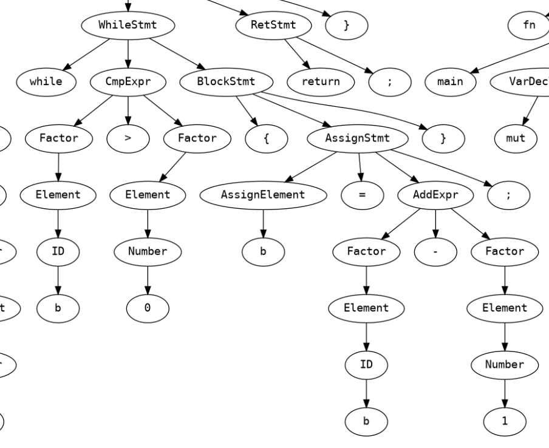

<head>
    <meta charset="UTF-8">
    <title>编译原理大作业 1 设计文档</title>
    <link rel="stylesheet" href="styles.css">
</head>

# Compiler Principle Project

## 1 总述

### 1.1 项目介绍

本项目使用 `C++` 实现一个类 `Rust` 语言的编译器前端，包括词法分析、语法分析、语义检查和中间代码生成四个部分。

基本功能是对输入的类 `Rust` 程序实现词法分析、语法分析、语义检查和中间代码生成，并输出若干文件体现分析结果。

采用 \<type: , value: \>@pos 格式展示词法分析后的 Token 序列；采用 AST 树的形式展示语法分析结果；采用打印符号表和错误报告的方式展示语义检查结果；采用 (op, arg1, arg2, res) 格式展示中间代码生成结果。


项目实现的词法和语法分析器能够支持所有给出的产生式的推导需求，但是由于时间关系，AST 打印和后续的语义检查及中间代码生成只实现了基础部分。

### 1.2 持续集成

为提升代码质量和团队协作效率，本项目集成了多种开发辅助工具，包括：

- 使用 `clang-format` 和 `.editorconfig` 统一代码风格；

- 利用 `clang-tidy` 进行静态代码分析；

- 通过 `git hooks` 实现提交前自动格式化与编译检查。

这些工具共同构成了项目开发中的 “轻量级持续集成（CI）” 流程的一部分，确保每次提交都满足基本的代码规范与质量要求。

### 1.3 文件组织架构说明

```shell
.
├── .clang-format    # clang-format 格式设置
├── .clang-tidy      # clang-tidy lint 检查设置
├── .editorconfig    # 基础格式设置
├── Makefile       # 构建文件
└── src                # 源代码
    ├── preproc        # 预处理
    ├── lexer          # 词法分析
    ├── parser         # 语法分析
    ├── semantic_check # 语义检查
    ├── ir_generate    # 中间代码生成
    ├── err_report     # 错误报告
    ├── util           # 工具函数
    └── main.cpp       # 程序入口点
```

### 1.4 小组成员及分工

- 2251881 徐  宏：负责代码框架搭建，方法调研，全链条参与全过程，包括文件流、词法语法分析、AST、语义检查、中间代码生成和错误处理。
- 2253299 戚澍闻：负责词法和语法分析部分模块，实现AST可视化、语义检查。
- 2253691 陈书煊：负责词法和语法分析部分模块，实现错误处理部分模块，负责文档和 ppt 撰写。

## 2 总体设计

### 2.1 系统架构

本项目当前共有以下模块:

- 核心驱动模块 **main**:
  - 处理命令行参数
  - 协调各模块执行流程
  - 管理输入输出
- 词法分析模块 **Lexer**:
  - 将源代码转换为Token序列
  - 管理关键字表
  - 跟踪Token位置
  - 实现最大匹配算法和有限自动机
- 语法分析模块 **Parser**:
  - 递归下降LL(2)分析
  - 包含文法规则实现和错误处理
  - 构建抽象语法树节点
- 语法树展示模块 **AST**:
  - 定义语法树节点结构
  - 支持语法树遍历和操作
  - 提供树形结构可视化功能
- 语义检查模块 **Semantic Checker**:
  - 定义符号表
  - 支持语义检查功能
- 中间代码生成模块 **IR generator**:
  - 根据语义信息生成中间代码
- 错误报告模块 **Error Reporter**:
  - 实现错误收集逻辑
  - 实现美化的错误报告 CLI UI

### 2.2 工作流程

1. `main()` 函数接收命令行参数，根据参数确认输入文件 `in_file` 和输出文件 `output.token` & `output.dot`，实例化词法分析器 lexer 和语法分析器 parser。

2. `lexer` 初始化一个 `keyword_table` 来记录需要识别的关键词，`lexer::nextToken()` 解析后续字符串，首先通过正则表达式识别 INT 和 ID 两类文法，在 ID 中识别各种关键词和保留字，在非 ID 和 INT 字符串中接着依次识别各种符号。

3. `parser` 实现了 `advance`, `match`, `check`, `checkAhead` 和 `expect` 等工具对词法分析后的 token 进行匹配、检查、前向检查等操作，并从 `parseProgram()` 开始对所有的非终结符节点进行递归下降分析。

4. `ast` 根据 parser 的分析结果，将各个结点采用 dot 形式绘制出语法树。

5. `error reporter` 在程序词法和语法分析器工作过程中收集错误并统一报告。

## 3 词法分析详细设计

### 3.1 词法单元 Token 设计

#### 3.1.1 Token 数据结构设计

`Token` 数据结构如下，数据成员有 `type`,`value` 和 `pos`，包含若干构造函数和运算符重载。

```cpp
class Token {
public:
    Token() = default;
    explicit Token(const Type& t, const std::string& v,
        const base::Position& p = base::Position{0, 0})
        : type(t), value(v), pos(p) {}
    Token(const Token& other) : type(other.type), value(other.value), pos(other.pos) {}
    Token(Token&& other) : type(std::move(other.type)),
        value(std::move(other.value)), pos(std::move(other.pos)) {}

    ~Token() = default;

    Token& operator=(const Token& rhs) = default;
    bool operator==(const Token& rhs) {
        return this->type == rhs.type && this->value == rhs.value;
    }
public:
    inline const std::string& getValue() const {
        return this->value;
    }
    inline const Type getType() const {
        return this->type;
    }
    inline const base::Position getPos() const {
        return this->pos;
    }
    inline void setPos(const base::Position& p) {
        this->pos = p;
    }
    inline void setPos(std::size_t r, std::size_t c) {
        this->pos.row = r;
        this->pos.col = c;
    }
    const std::string toString() const;
private:
    Type           type;  // token type
    std::string    value; // string
    base::Position pos;   // position
};
```

#### 3.1.2 Token 类型枚举定义

```cpp
// token type
enum class Type {
    // Group 0
    END, // end of file

    // Group 1
    ID, INT, // identifier, integer
    IF, ELSE,
    WHILE, FOR,
    I32,
    LET,
    RETURN,
    MUT,
    FN,
    IN,
    LOOP,
    BREAK, CONTINUE,

    REF,        //  &
    LPAREN,     //  (
    RPAREN,     //  )
    LBRACE,     //  {
    RBRACE,     //  }
    LBRACK,     //  [
    RBRACK,     //  ]
    SEMICOLON,  //  ;
    COLON,      //  :
    COMMA,      //  ,
    OP_PLUS,    //  +

    // Group 2
    ASSIGN,     //  =
    OP_MINUS,   //  -
    OP_MUL,     //  *
    OP_DIV,     //  /
    OP_GT,      //  >
    OP_LT,      //  <
    DOT,        //  .

    OP_EQ,      //  ==
    OP_NEQ,     //  !=
    OP_GE,      //  >=
    OP_LE,      //  <=
    DOTS,       //  ..
    ARROW,      //  ->
    SIN_COM,    //  //
    LMUL_COM,   //  /*
    RMUL_COM    //  */
};
```

### 3.2 词法分析器 Lexer 实现

#### 3.2.1 关键字表实现

关键字表包含一个 `std::unordered_map` 哈希表结构，外部可以通过传入 name 获得对应的 token type. 这里的 token type 是枚举类 `lexer::token::Type` 中的一员。

```cpp
class KeywordTable {
public:
    KeywordTable()  = default;
    ~KeywordTable() = default;
public:
    inline bool iskeyword(std::string v) const {
        return (keywords.find(v) != keywords.end());
    }
    token::Type getKeyword(std::string v) const {
        std::ostringstream oss;
        if (keywords.find(v) == keywords.end()) {
            oss << "parameter (" << v << ") is not a keyword!";
            reporter->report(
                error::InternalErrorType::UnknownKeyword,
                oss.str()
            );
        }
        return keywords.find(v)->second;
    }
    inline void addKeyword(std::string n, token::Type t) {
        this->keywords.emplace(n, t);
    }
    inline void setErrReporter(std::shared_ptr<error::ErrorReporter> reporter) {
        this->reporter = std::move(reporter);
    }
private:
    std::shared_ptr<error::ErrorReporter>        reporter;
    std::unordered_map<std::string, token::Type> keywords;
};
```

Lexer 在初始化时构造关键词表,供后续词法分析使用.

```cpp
void ToyLexer::initKeywordTable(void) {
    using token::Token;
    keyword_table.addKeyword("if",       Token::IF);
    keyword_table.addKeyword("fn",       Token::FN);
    keyword_table.addKeyword("in",       Token::IN);
    keyword_table.addKeyword("i32",      Token::I32);
    keyword_table.addKeyword("let",      Token::LET);
    keyword_table.addKeyword("mut",      Token::MUT);
    keyword_table.addKeyword("for",      Token::FOR);
    keyword_table.addKeyword("loop",     Token::LOOP);
    keyword_table.addKeyword("else",     Token::ELSE);
    keyword_table.addKeyword("break",    Token::BREAK);
    keyword_table.addKeyword("while",    Token::WHILE);
    keyword_table.addKeyword("return",   Token::RETURN);
    keyword_table.addKeyword("continue", Token::CONTINUE);
    this->keyword_table.setErrReporter(this->reporter);
}
```

#### 3.2.2 有限自动机设计

<br>


#### 3.2.3有限自动机实现

step 1：采用 `std::regex` 库使用正则表达式匹配 INT 和 ID 类。

```cpp
static const std::vector<std::pair<token::Type, std::regex>> patterns {
    {token::Type::ID,  std::regex{R"(^[a-zA-Z_]\w*)"}},
    {token::Type::INT, std::regex{R"(^\d+)"}}
};
```

step 2: 若匹配到ID,检查是否为关键词.

```cpp
std::string view {this->text[this->pos.row].substr(this->pos.col)};
for (const auto& [type, expression] : patterns) {
    std::smatch match;
    if (std::regex_search(view, match, expression)) {
        auto p = this->pos;
        shiftPos(match.length(0));
        if (type == token::Type::ID && this->keyword_table.iskeyword(match.str(0))) {
            auto keyword_type = this->keyword_table.getKeyword(match.str(0));
            return Token{keyword_type, match.str(0), p};
        }
        return Token{type, match.str(0), p};
    }
}
```

step 3: 依次匹配剩余符号,包括单字符和双字符组合,优先匹配双字符.

```cpp
Token token       {};        // 识别到的词法单元
char  first_char  {view[0]}; // 当前看到的第一个字符
char  second_char {view.length() > 1 ? view[1] : '\0'}; // 第二个字符

// 检测算符和标点符号
switch (first_char) {
default:
    break;
case '(':
    token = Token{token::Type::LPAREN, std::string{"("}};
    break;
case ')':
    token = Token{token::Type::RPAREN, std::string{")"}};
    break;
case '{':
    token = Token{token::Type::LBRACE, std::string{"{"}};
    break;
case '}':
    token = Token{token::Type::RBRACE, std::string{"}"}};
    break;
case '[':
    token = Token{token::Type::LBRACK, std::string{"["}};
    break;
case ']':
    token = Token{token::Type::RBRACK, std::string{"]"}};
    break;
case ';':
    token = Token{token::Type::SEMICOLON, std::string{";"}};
    break;
case ':':
    token = Token{token::Type::COLON, std::string{":"}};
    break;
case ',':
    token = Token{token::Type::COMMA, std::string{","}};
    break;
case '+':
    token = Token{token::Type::OP_PLUS, std::string{"+"}};
    break;
case '=':
    if (second_char == '='){
        token = Token{token::Type::OP_EQ, std::string{"=="}};
    } else {
        token = Token{token::Type::ASSIGN, std::string{"="}};
    }
    break;
case '-':
    if (second_char == '>'){
        token = Token{token::Type::ARROW, std::string{"->"}};
    } else {
        token = Token{token::Type::OP_MINUS, std::string{"-"}};
    }
    break;
case '*':
    if (second_char == '/'){
        token = Token{token::Type::RMUL_COM, std::string{"*/"}};
    } else {
        token = Token{token::Type::OP_MUL, std::string{"*"}};
    }
    break;
case '/':
    if (second_char == '/'){
        token = Token{token::Type::SIN_COM, std::string{"//"}};
    } else if (second_char == '*'){
        token = Token{token::Type::LMUL_COM, std::string{"/*"}};
    } else {
        token = Token{token::Type::OP_DIV, std::string{"/"}};
    }
    break;
case '>':
    if (second_char == '=') {
        token = Token{token::Type::OP_GE, std::string{">="}};
    } else {
        token = Token{token::Type::OP_GT, std::string{">"}};
    }
    break;
case '<':
    if (second_char == '='){
        token = Token{token::Type::OP_LE, std::string{"<="}};
    } else {
        token = Token{token::Type::OP_LT, std::string{"<"}};
    }
    break;
case '.':
    if(second_char == '.'){
        token = Token{token::Type::DOTS, std::string{".."}};
    } else{
        token = Token{token::Type::DOT, std::string{"."}};
    }
    break;
case '!':
    if(second_char == '='){
        token = Token{token::Type::OP_NEQ, std::string{"!="}};
    }
    break;
case '&':
    token = Token{token::Type::Ref, std::string{"&"}};
    break;
}

token.setPos(this->pos);
if (!token.getValue().empty()) {
    this->pos += token.getValue().length();
    return token;
}

base::Position p = this->pos;
std::size_t idx = 0;
for (; idx < view.length(); ++idx) {
    if (std::isspace(view[idx])) {
        break;
    }
}
shiftPos(idx);

return std::unexpected(error::LexError{
    error::LexErrorType::UnknownToken,
    "识别到未知 token: " + view.substr(0, idx),
    p.row,
    p.col,
    view.substr(0, idx)
});
```

#### 3.2.4 位置信息跟踪

在 `lexer` 中定义了数据成员 `pos` 记录当前分析到的代码位置，从而获取位置信息并对每个 token 赋予位置信息。

## 4 语法分析详细设计

### 4.1 文法设计

#### 4.1.1 类RUST语言的文法定义

采用 LL(2) 兼容的上下文无关文法，核心规则如下：

```shell
Prog        → Decl*
Decl        → FuncDecl
FuncDecl    → "fn" ID "(" Args ")" ("->" VarType)? BlockStmt
Args        → (Arg ("," Arg)*)?
Arg         → ("mut")? ID ":" VarType
BlockStmt   → "{" Stmt* "}"
Stmt        → VarDeclStmt | AssignStmt | IfStmt | WhileStmt | ...
Expr        → FuncExprBlockStmt | IfExpr | LoopStmt | CmpExpr
```

实际实现的产生式如下：

```shell
Prog -> (FuncDecl)*
FuncDecl -> FuncHeaderDecl BlockStmt
BlockStmt -> FuncExprBlockStmt
FuncHeaderDecl -> "fn" "<ID>" "(" (arg ("," arg)*)? ")" ("->" VarType)?
arg -> VarDeclBody ":" VarType
VarDeclBody -> ("mut")? "<ID>"
VarType -> (["&" | "&" "mut"])? [Integer | Array | Tuple]
Integer -> "i32"
Array -> "[" VarType ";" "<INT>" "]"
Tuple -> "(" (VarType ",")+ (VarType)? ")"
BlockStmt -> "{" (Stmt)* "}"
FuncExprBlockStmt -> "{" (Stmt)* Expr "}"
Stmt -> VarDeclStmt | RetStmt | CallExpr | AssignStmt | ExprStmt | IfStmt | WhileStmt | ForStmt | LoopStmt | BreakStmt | ContinueStmt | NullStmt
VarDeclStmt -> "let" ("mut")? "<ID>" (":" VarType)? ("=" Expr)? ";"
RetStmt -> "return" (CmpExpr)? ";"
CallExpr -> "<ID>" "(" (arg ("," arg)*)? ")"
AssignStmt -> AssignElement "=" Expr ";"
AssignElement -> Deference | ArrayAccess | TupleAccess | Variable
Deference -> "*" "<ID>"
ArrayAccess -> "<ID>" "[" Expr "]"
TupleAccess -> "<ID>" "." "<INT>"
Variable -> "<ID>"
ExprStmt -> Expr ";"
IfStmt -> "if" CmpExpr BlockStmt (ElseClause)*
ElseClause -> "else" ("if" Expr)? BlockStmt
WhileStmt -> "while" CmpExpr BlockStmt
ForStmt -> "for" VarDeclBody "in" CmpExpr ".." CmpExpr BlockStmt
LoopStmt -> "loop" BlockStmt
BreakStmt -> "break" (Expr)? ";"
ContinueStmt -> "continue" ";"
NullStmt -> ";"
Expr -> FuncExprBlockStmt | IfExpr | loopExpr | CmpExpr
CmpExpr -> AddExpr ([< | <= | > | >= | == | !=] AddExpr)*
AddExpr -> MulExpr ([+ | -] MulExpr)*
MulExpr -> Factor ([* | /] Factor)*
Factor -> ArrayElements | TupleElements | (["&" | "&" "mut"])? Element | ParenthesisExpr
ArrayElements -> "[" Expr ("," Expr)* "]"
TupleElements -> "(" (Expr ",")+ (Expr)? ")"
Element -> ParenthesisExpr | "<INT>" | AssignElement | CallExpr | Variable
ParenthesisExpr -> "(" CmpExpr ")"
IfExpr -> "if" Expr FuncExprBlockStmt "else" FuncExprBlockStmt
```

#### 4.1.2 消除左递归

产生式左递归主要出现在 Expr 相关内容：

```shell
3.2 表达式增加计算和比较（前置规则 3.1）:

Expr -> Expr [< | <= | > | >= | == | !=] AddExpr
AddExpr -> AddExpr [+ | -] Item
Item -> Item [* | /] Factor
```

我们采用分层处理优先级方法实现 Expr 并消除左递归：

```shell
Expr -> CmpExpr
CmpExpr -> AddExpr ([< | <= | > | >= | == | !=] AddExpr)*
AddExpr -> MulExpr ([+ | -] MulExpr)*
MulExpr -> Factor ([* | /] Factor)*
Factor -> ArrayElements | TupleElements | (["&" | "&" "mut"])? Element | ParenthesisExpr
```

#### 4.1.3 通过 vector 实现右递归减少递归层数

以 `Args → (Arg ("," Arg)*)?` 为例，采用 `std::vector` 来代替右递归.

```cpp
std::vector<ast::ArgPtr> argv {};
while(!check(TokenType::RPAREN)) {
    argv.push_back(parseArg());
    if (!check(TokenType::COMMA)) {
        break;
    }
    advance();
}
```

### 4.2 语法分析器 Parser 实现

#### 4.2.1 Token 流管理

```cpp
class Parser {
private:
    void advance();
    bool match(lexer::token::Type type);
    bool check(lexer::token::Type type) const;
    bool checkAhead(lexer::token::Type type);
    void expect(lexer::token::Type type, const std::string& error_msg);

private:
    std::shared_ptr<error::ErrorReporter> reporter; // error reporter
    std::function<std::expected<lexer::token::Token, error::LexError>()> nextTokenFunc; // 获取下一个 token
    lexer::token::Token                current;   // 当前看到的 token
    std::optional<lexer::token::Token> lookahead; // 往后看一个 token
};
```

采用 **三明治模型** 管理 Token:

- current 表示当前 token
- lookahead 表示预读 token
- nextTokenFunc 接收 `lexer::nextToken()`

主要方法有：`advance`, `match`, `check`, `checkAhead`, `expect`，这些方法为词法分析提供必要功能，详见下面注释与代码：

```cpp
/**
 * @brief 向前扫描一个 token
 */
void Parser::advance() {
    if (lookahead.has_value()) {
        current = lookahead.value();
        lookahead.reset(); // 清除 lookahead 中的值
    } else {
        if (auto token = nextTokenFunc();
            token.has_value()) {
            current = token.value();
        } else { // 识别到未知 token，且需立即终止
            reporter->report(token.error(), true);
        }
    }
}

/**
 * @brief  匹配当前 token，并向前扫描一个 token
 * @param  type 需匹配的 token 类型
 * @return 是否成功匹配
 */
bool Parser::match(lexer::token::Type type) {
    if (check(type)) {
        advance();
        return true;
    }
    return false;
}

/**
 * @brief  检查当前看到的 token 是否存在，如果存在判断其类型是否为给定值
 * @param  type 指定的 token 类型
 * @return 是否通过检查
 */
bool Parser::check(lexer::token::Type type) const {
    return current.getType() == type;
}

/**
 * @brief  向前检查一个 token，判断其类型是否为给定值
 * @param  type 指定的 token 类型
 * @return 是否通过检查
 */
bool Parser::checkAhead(lexer::token::Type type) {
    if (!lookahead.has_value()) {
        if (auto token = nextTokenFunc();
            token.has_value()) {
            lookahead = token.value(); // 获取下一个 token
        } else { // 识别到未知 token，且需立即终止
            reporter->report(token.error(), true);
        }
    }
    return lookahead.has_value() && lookahead->getType() == type;
}

/**
 * @brief 匹配期望的 token，如果未匹配成功则抛出 runtime error
 * @param type 期望的 token 类型
 * @param msg  错误信息
 */
void Parser::expect(lexer::token::Type type, const std::string& msg) {
    if (!match(type)) {
        reporter->report(
            error::ParseErrorType::UnexpectToken,
            msg,
            current.getPos().row,
            current.getPos().col,
            current.getValue()
        );
    }
}
```

#### 4.2.2 LL(2) 解析器设计

##### 递归下降解析

对于每个非终结符，都有对应的解析函数：

```cpp
ast::ProgPtr              parseProgram();
ast::FuncDeclPtr          parseFuncDecl();
ast::FuncHeaderDeclPtr    parseFuncHeaderDecl();
ast::NodePtr              parseStmtOrExpr();
ast::BlockStmtPtr         parseBlockStmt();
ast::RetStmtPtr           parseRetStmt();
ast::ArgPtr               parseArg();
ast::VarDeclStmtPtr       parseVarDeclStmt();
ast::AssignStmtPtr        parseAssignStmt(ast::AssignElementPtr&&);
ast::AssignElementPtr     parseAssignElement();
ast::ExprPtr              parseExpr(std::optional<ast::AssignElementPtr>);
ast::ExprPtr              parseCmpExpr(std::optional<ast::AssignElementPtr>);
ast::ExprPtr              parseAddExpr(std::optional<ast::AssignElementPtr>);
ast::ExprPtr              parseMulExpr(std::optional<ast::AssignElementPtr>);
ast::ExprPtr              parseFactor(std::optional<ast::AssignElementPtr>);
ast::ExprPtr              parseElementExpr(std::optional<ast::AssignElementPtr>);
ast::CallExprPtr          parseCallExpr();
ast::IfStmtPtr            parseIfStmt();
ast::ElseClausePtr        parseElseClause();
ast::WhileStmtPtr         parseWhileStmt();
ast::ForStmtPtr           parseForStmt();
ast::LoopStmtPtr          parseLoopStmt();
ast::VarTypePtr           parseVarType();
ast::FuncExprBlockStmtPtr parseFuncExprBlockStmt();
ast::IfExprPtr            parseIfExpr();
ast::BreakStmtPtr         parseBreakStmt();
```

每个函数的返回值都是 AST 结点指针，顶层是 `parseProgram()` 供外部调用，由此逐层向下递归分析整个程序。

##### 解析函数示例

由于这些函数比较复杂，所以只展示几个代表性函数的实现。

```cpp
/**
 * @brief  解析函数头声明
 * @return ast::FuncHeaderDeclPtr - AST Function Header Declaration 结点指针
 */
[[nodiscard]]
ast::FuncHeaderDeclPtr Parser::parseFuncHeaderDecl() {
    // FuncHeaderDecl -> fn <ID> ( (arg (, arg)*)? ) (-> VarType)?
    using TokenType = lexer::token::Type;

    expect(TokenType::FN, "此处期望有一个 'fn'");

    std::string name = current.getValue(); // function name
    expect(TokenType::ID, "此处期望有一个 '<ID>' 作为函数名");

    expect(TokenType::LPAREN, "此处期望有一个 '('");

    std::vector<ast::ArgPtr> argv {};
    while(!check(TokenType::RPAREN)) {
        argv.push_back(parseArg());
        if (!check(TokenType::COMMA)) {
            break;
        }
        advance();
    }

    expect(TokenType::RPAREN, "Expected ')'");

    if (check(TokenType::ARROW)) {
        expect(TokenType::ARROW, "Expected '->'");
        auto type = parseVarType();
        return std::make_shared<ast::FuncHeaderDecl>(std::move(name), std::move(argv), std::move(type));
    }
    return std::make_shared<ast::FuncHeaderDecl>(std::move(name), std::move(argv), std::nullopt);
}
```

`Parser::parseFuncHeaderDecl()` 实现的就是函数头对应 `FuncHeaderDecl -> fn <ID> ( Args )` 和 `FuncHeaderDecl -> fn <ID> ( Args ) -> VarType` 两条产生式，该函数可以体现出解析器的实现特点：

1. 充分利用具有错误提示的 `expect` 来实现 Token 匹配。
2. `advance()` 通常与 `if/while (check())` 结合使用，来实现一个非终结符多条产生式的不同分支情况，来实现 LL(1)。
3. 对于右递归，如 Args 的解析，就会充分使用 `std::vector` 来操作。

```cpp
/**
 * @brief  解析语句或表达式
 * @return ast::NodePtr - Stmt 或 Expr 结点指针
 */
[[nodiscard]]
ast::NodePtr Parser::parseStmtOrExpr() {
    using TokenType = lexer::token::Type;

    ast::StmtPtr stmt {};
    if (check(TokenType::LET)) {
        stmt = parseVarDeclStmt();
    } else if (check(TokenType::RETURN)) {
        stmt = parseRetStmt();
    } else if (check(TokenType::ID)||check(TokenType::OP_MUL)) {
        if (check(TokenType::ID) && checkAhead(TokenType::LPAREN)) {
            return parseCallExpr();
        }
        /*
         * x, *x, x[idx], x.idx 都即可以作为赋值语句的左值，
         * 又可以作为表达式的一个操作数
         */
        auto elem = parseAssignElement();
        if (check(TokenType::ASSIGN)) {
            stmt =  parseAssignStmt(std::move(elem));
        } else {
            return parseExpr(elem);
        }
    } else if (check(TokenType::INT)||check(TokenType::LPAREN)) {
        return parseExpr();
    } else if (check(TokenType::IF)) {
        stmt = parseIfStmt();
    } else if (check(TokenType::WHILE)) {
        stmt = parseWhileStmt();
    } else if (check(TokenType::FOR)) {
        stmt = parseForStmt();
    } else if (check(TokenType::LOOP)) {
        stmt = parseLoopStmt();
    } else if (check(TokenType::BREAK)) {
        stmt = parseBreakStmt();
    } else if (check(TokenType::CONTINUE)) {
        stmt = std::make_shared<ast::ContinueStmt>();
        advance();
        expect(TokenType::SEMICOLON,"Expected ';'");
    } else if (check(TokenType::SEMICOLON)){
        stmt = std::make_shared<ast::NullStmt>();
        advance();
    }

    return stmt;
}
```

`Parser::parseStmtOrExpr()` 是整个语法分析器中非常重要的函数，因为单个Statement是程序中最复杂的单位，需要充分的前向搜索来确定下一步调用的是哪个解析函数，而这里就使用了 checkAhead 来实现 LL(2)。

## 5 AST详细设计

### 5.1 AST 节点设计

在本项目中，我们为语言的各类语句与表达式设计了一套 **结构化、面向对象的 AST（抽象语法树）节点体系**。每类语法成分均对应一个派生自抽象基类 `Stmt` 或 `Expr` 的具体节点结构，并通过智能指针统一管理节点生命周期，便于后续分析与可视化处理。

#### 5.1.1 设计原则

1. **语法对齐**：每种语言结构均映射为一个对应的 AST 节点类，确保语法到语义结构的准确还原。

2. **层次分明**：节点之间通过组合表达语义层级。

3. **类型枚举分发**：每个节点实现 `type()` 方法，返回 `NodeType` 枚举值，用于类型匹配与动态分发。

4. **可视化友好**：节点设计天然支持转为可视化结构 `DOT` 格式，用于调试与展示。

#### 5.1.2 节点类型

根据上述实际实现的产生式，对不同类型的节点予以定义，由于本次实现功能已经超出基本要求，在 AST 节点定义中已经给出所有要求所需要的节点类型。

- **基础节点类型**
  - Prog：程序入口，包含所有顶层声明。
  - Decl：通用声明类型，是函数声明等的基类。
  - Stmt：语句基类。
  - Expr：表达式基类。
  - VarType：变量类型（如 i32、\[i32 ; 3\]、(i32, i32)）。
  - Arg：函数参数节点。

- **声明与语句类节点**
  - FuncDecl：函数定义，包括头部和主体。
  - FuncHeaderDecl：函数头，包含名称、返回类型与参数。
  - BlockStmt：语句块，表示 { ... }。
  - ExprStmt：表达式语句。
  - RetStmt：返回语句。
  - VarDeclStmt：变量声明。
  - AssignStmt：赋值语句。
  - VarDeclAssignStmt：声明并赋值语句。
  - IfStmt：if 条件语句，包含多个 ElseClause。
  - ElseClause：if 的 else 或 else-if 子句。
  - WhileStmt：while 循环语句。
  - ForStmt：for 循环语句。
  - LoopStmt：无限循环语句。
  - BreakStmt：中断语句。
  - ContinueStmt：跳过语句。
  - NullStmt：空语句 ;
- **表达式类节点**
  - Number：数字常量。
  - Factor：因子节点，表达式的基本单位。
  - ComparExpr：比较表达式。
  - ArithExpr：算术表达式。
  - CallExpr：函数调用表达式。
  - ParenthesisExpr：括号表达式。
  - FuncExprBlockStmt：匿名函数表达式（带语句块）。
  - IfExpr：条件表达式（if 表达式）。
  - ArrayElements：数组元素列表。
  - TupleElements：元组元素列表。
- **类型节点**
  - Integer：整数类型。
  - Array：数组类型。
  - Tuple：元组类型。
- **左值与访问节点**
  - Variable：变量。
  - Dereference：解引用。
  - ArrayAccess：数组访问（如 a[i]）。
  - TupleAccess：元组访问（如 t.0）。

各节点通过重写 `NodeType type() const` 方法实现运行时类型识别，并支持向下转型操作，以支持语法结构分析与转换。

### 5.2 AST 构建

抽象语法树（AST）的构建是在语法分析阶段完成的。每一种语法结构都对应一个具体的 AST 节点类型，这些节点都派生自统一的基类 `Node`。节点的构造过程与语法规则一一对应，在语法匹配的过程中由递归下降分析器动态生成。

整个 AST 结构通过智能指针组织为 **一棵具有层级关系的树**，能够完整表达源代码的语法结构。下面是 AST 中基础与关键结构体的定义的示例：

- 基础节点类型定义

```cpp
// 所有 AST 结点的基类
struct Node {
    virtual constexpr NodeType type() const = 0;
    virtual ~Node() = default;
};
using NodePtr = std::shared_ptr<Node>;
```

- 程序入口节点定义

```cpp
// Program
struct Prog : Node {
    std::vector<DeclPtr> decls; // declarations

    Prog() = default;
    explicit Prog(const std::vector<DeclPtr>& ds);
    explicit Prog(std::vector<DeclPtr>&& ds);

    constexpr NodeType type() const override {
        return NodeType::Prog;
    }
};
using  ProgPtr = std::shared_ptr<Prog>;
```

- 声明节点基类

```cpp
// Declaration 节点
struct Decl : Node {
    constexpr NodeType type() const override {
        return NodeType::Decl;
    }
    virtual ~Decl() = default;
};
using DeclPtr = std::shared_ptr<Decl>;

// Variable Type
struct VarType : Node {
    RefType ref_type = RefType::Normal;

    VarType() = default;
    explicit VarType(RefType rt) : ref_type(rt) {}
    virtual ~VarType() = default;

    constexpr NodeType type() const override {
        return NodeType::VarType;
    }
};
using  VarTypePtr = std::shared_ptr<VarType>;

// Argument
struct Arg : Node {
    VarDeclBodyPtr variable; // variable
    VarTypePtr     var_type; // variable type

    Arg() = default;
    explicit Arg(const VarDeclBodyPtr& var, const VarTypePtr& vt)
        : variable(var), var_type(vt) {}
    explicit Arg(VarDeclBodyPtr&& var, VarTypePtr&& vt)
        : variable(std::move(var)), var_type(std::move(vt)) {}

    constexpr NodeType type() const override {
        return NodeType::Arg;
    }
};
using  ArgPtr = std::shared_ptr<Arg>;

// Statement
struct Stmt : Node {
    virtual ~Stmt() = default;
    constexpr NodeType type() const override {
        return NodeType::Stmt;
    }
};
using  StmtPtr = std::shared_ptr<Stmt>;

// Expression
struct Expr : Node {
    virtual ~Expr() = default;
    constexpr NodeType type() const override {
        return NodeType::Expr;
    }
};
using  ExprPtr = std::shared_ptr<Expr>;
```

- 具体节点拓展，此处以 **函数头声明节点** 为例

```cpp
// Function header declaration
struct FuncHeaderDecl : Decl {
    std::string               name;        // 函数名
    std::vector<ArgPtr>       argv;        // 参数列表
    std::optional<VarTypePtr> retval_type; // 返回类型

    FuncHeaderDecl() = default;
    explicit FuncHeaderDecl(const std::string& n,
        const std::vector<ArgPtr>& av,
        const std::optional<VarTypePtr>& rt)
        : name(n), argv(av), retval_type(rt) {}
    explicit FuncHeaderDecl(std::string&& n,
        std::vector<ArgPtr>&& av,
        std::optional<VarTypePtr>&& rt);

    constexpr NodeType type() const override {
        return NodeType::FuncHeaderDecl;
    }
};
using FuncHeaderDeclPtr = std::shared_ptr<FuncHeaderDecl>;
```

下面按照逻辑模块进行分层展示各节点之间的结构与类别：

```shell
Node
├── Prog
├── Arg
├── Decl
│   ├── FuncDecl
│   ├── VarDeclStmt
│   │   └── VarDeclAssignStmt
│   └── FuncHeaderDecl
├── Stmt
│   ├── BlockStmt
│   │   └── FuncExprBlockStmt
│   ├── ExprStmt
│   ├── RetStmt
│   ├── VarDeclStmt
│   │   └── VarDeclAssignStmt
│   ├── AssignStmt
│   ├── VarDeclAssignStmt
│   ├── ElseClause
│   ├── IfStmt
│   ├── WhileStmt
│   ├── ForStmt
│   ├── LoopStmt
│   ├── BreakStmt
│   ├── ContinueStmt
│   └── NullStmt
├── Expr
│   ├── Number
│   ├── Factor
│   ├── ComparExpr
│   ├── ArithExpr
│   ├── CallExpr
│   ├── ParenthesisExpr
│   ├── FuncExprBlockStmt
│   ├── LoopStmt
│   ├── IfExpr
│   ├── ArrayElements
│   └── TupleElements
├── VarType
│   ├── Integer
│   ├── Array
│   └── Tuple
├── VarDeclBody
└── AssignElement
    ├── Variable
    ├── Dereference
    ├── ArrayAccess
    └── TupleAccess
```

### 5.3 AST 可视化

#### 5.3.1 AST 转 DOT 格式函数

为了实现 AST 的可视化展示，设计了统一的导出接口 `ast2Dot`，用于遍历整个语法树并输出 DOT 图格式内容，结构如下：

```cpp
/**
 * @brief   将抽象语法树转换为 dot 格式，并输出到文件
 * @param   out 输出流对象
 * @param   prog 程序的抽象语法树指针
 */
void ast2Dot(std::ofstream& out, const ProgPtr& prog) {
    out << "digraph AST {" << std::endl
        << "    node [shape=ellipse, fontname=\"Courier\"]" << std::endl << std::endl
        << "    // define nodes" << std::endl;

    DotNodeDecl n_prog = str2NodeDecl("Prog");

    std::ostringstream oss_nd;
    std::ostringstream oss_ed;

    oss_nd << nodeDecls2Str(n_prog);
    for (const auto& decl : prog->decls) {
        assert(std::dynamic_pointer_cast<FuncDecl>(decl));
        auto [n_fd, fd_nd, fd_ed] = funcDecl2Dot(std::dynamic_pointer_cast<FuncDecl>(decl));
        oss_nd << fd_nd;
        oss_ed << edge2Str(n_prog, n_fd) << fd_ed;
    }

    out << oss_nd.str() << std::endl
        << "    // define edges" << std::endl
        << oss_ed.str() << std::endl
        << "}" << std::endl;
}
```

此函数中核心流程：
1. 创建根节点 Prog
2. 遍历每个函数声明 FuncDecl
3. 调用 funcDecl2Dot 将其转为节点描述与边描述
4. 最终统一输出所有节点与边

#### 5.3.2 DOT 结点声明与生成

在 AST 可视化过程中，我们需要将抽象语法树中的每个语法结点转换为 DOT 图的结点，以便后续图形化展示。为此，定义了一个 `DotNodeDecl` 结构体用于表示 DOT 语言中的图结点，其设计如下所示：

```cpp
struct DotNodeDecl {
    std::string name  {}; // 结点名 - 唯一，用于区分不同结点
    std::string label {}; // 标签 - 不唯一，用于图片显示

    DotNodeDecl() = default;
    explicit DotNodeDecl(const std::string& n, const std::string& l)
        : name(n), label(l) {}
    explicit DotNodeDecl(std::string&& n, std::string&& l)
        : name(std::move(n)), label(std::move(l)) {}

    ~DotNodeDecl() = default;

    inline bool initialized() const {
        return name.length() > 0 && label.length() > 0;
    }
    inline std::string toString() const { return name + label; }
};
```
该结构体包含以下两个核心字段：

- `name`：用于标识结点的唯一名称，在 DOT 文件中每个结点必须具有唯一标识；
- `label`：用于图形化展示时的标签名称，支持相同类型的多个结点使用相同标签。

这个结构体作为 DOT 图生成的基础，支撑了整个 AST 向图形结构的映射过程，是可视化模块的重要组成部分。

为了简化结点的构造过程，我们进一步封装了如下函数 `str2NodeDecl`：
```cpp
/**
 * @brief  通过名称构造带编号的 DOT 节点声明
 * @param  s std::string 节点名称
 * @return DotNodeDecl
 */
static DotNodeDecl str2NodeDecl(const std::string& s) {
    std::ostringstream oss;
    oss << s << cnt++; // 确保唯一性
    std::string name  {oss.str()},
                label {"[label = \"" + s + "\"]"};

    return DotNodeDecl{name, label};
}
```

该函数实现的关键在于通过`全局计数器 cnt `自动为结点名称添加编号后缀，从而确保 DOT 图中每个结点名称的唯一性。同时，它统一封装了 DOT 标签的构造逻辑，返回标准的 DotNodeDecl 对象，方便在遍历 AST 过程中直接调用使用。

#### 5.3.3 DOT 结构化输出函数

在完成 AST 向 DotNodeDecl 的转换后，为便于构造完整的 DOT 图文件，还需要将结点与边统一转化为符合 DOT 语法的字符串。为此，设计了如下辅助函数：

1. **DOT 结点列表转字符串**

```cpp
/**
 * @brief  将一系列 DOT 结点声明转换为字符串
 * @param  nd 变长参数
 * @return std::string
 */
template<typename... T> // 变长参数模板
static std::string nodeDecls2Str(const T&... nd) {
    static_assert((std::is_same_v<T, DotNodeDecl> && ...),
        "All arguments must be DotNodeDecl");

    std::ostringstream oss;
    ((oss << "    " << nd.toString() << std::endl), ...);

    return oss.str();
}
```
这个函数支持变长参数，允许传入多个 DotNodeDecl 类型的结点，并在编译期进行类型检查，保证类型安全。输出格式符合 DOT 图的结点声明规范。

2. **DOT 边的单条转换**

```cpp
/**
 * @brief  将一条 DOT 边转换为相应 DOT 声明字符串
 * @param  a 起始节点
 * @param  b 终止结点
 * @return std::string DOT 边声明字符串
 */
inline static std::string edge2Str(const DotNodeDecl& a, const DotNodeDecl& b) {
    std::ostringstream oss;
    oss << "    " << a.name << " -> " << b.name << std::endl;
    return oss.str();
}
```

这个函数用于生成单条边的 DOT 表达式，形式为 `A -> B`，符合 DOT 语言的语义连接规范。

3. **多条边的批量转换**

```cpp
/**
 * @brief  将边列表转换为 DOT 格式字符串
 * @param  edges 边的起点和终点节点对列表
 * @return 表示所有边的字符串，每行一条 DOT 边语句
 */
static std::string edges2Str(std::initializer_list<std::pair<DotNodeDecl, DotNodeDecl>> edges) {
    std::ostringstream oss;

    for(auto edge : edges) {
        oss << "    " << edge.first.name << " -> " << edge.second.name << std::endl;
    }

    return oss.str();
}
```

这个函数支持通过初始化列表批量生成边声明，适用于构造多个子节点连接场景，常配合 AST 遍历使用以构建完整图结构。

以上函数共同构成了 AST 可视化中 DOT 输出模块的核心逻辑，配合 DotNodeDecl 结构体与生成函数，可高效构建语法树的图形化表示。

4. **AST 结点辅助构造函数**

在生成 DOT 图的过程中，除了需要将 AST 的结构节点转换为 DOT 格式节点外，还需要将具体的词法标记（Token）作为图中叶子节点进行可视化表示。为此，定义了辅助函数 `tokenType2NodeDecl`：

```cpp
/**
 * @brief  通过 token type 构造 DOT 结点声明
 * @param  t token type
 * @return DotNodeDecl
 */
static DotNodeDecl tokenType2NodeDecl(lexer::token::Type t) {
    using TokenType = lexer::token::Type;
    static const std::unordered_map<TokenType, std::string> map {
        {TokenType::REF,       "&"},
        {TokenType::LPAREN,    "("},
        {TokenType::RPAREN,    ")"},
        {TokenType::LBRACE,    "{"},
        {TokenType::RBRACE,    "}"},
        {TokenType::LBRACK,    "["},
        {TokenType::RBRACK,    "]"},
        {TokenType::SEMICOLON, ";"},
        {TokenType::COLON,     ":"},
        {TokenType::COMMA,     ","},
        {TokenType::ASSIGN,    "="},
        {TokenType::DOT,       "."},
        {TokenType::DOTS,      ".."},
        {TokenType::ARROW,     "->"},
        {TokenType::IF,        "if"},
        {TokenType::ELSE,      "else"},
        {TokenType::WHILE,     "while"},
        {TokenType::OP_PLUS,   "+"},
        {TokenType::OP_MINUS,  "-"},
        {TokenType::OP_MUL,    "*"},
        {TokenType::OP_DIV,    "/"},
        {TokenType::OP_EQ,     "=="},
        {TokenType::OP_NEQ,    "!="},
        {TokenType::OP_LT,     "<"},
        {TokenType::OP_LE,     "<="},
        {TokenType::OP_GT,     ">"},
        {TokenType::OP_GE,     ">="}
    };

    if (map.find(t) == map.end()) {
        throw std::runtime_error{"tokenType2NodeDecl(): Unknown Token Type."};
    }

    std::ostringstream oss;
    oss << lexer::token::tokenType2str(t) << cnt++;
    std::string name {oss.str()},
                label = "[label = \"" + map.find(t)->second + "\"]";

    return DotNodeDecl{name, label};
}
```

这个函数是连接词法分析器输出与 AST 可视化的重要桥梁，提升了图形展示的清晰度与一致性。

#### 5.3.4 AST 转 DOT 转换示例

本节以具体语法结构为例，展示如何将 AST 中的结点及其子结构转换为 DOT 图的格式。以下选取了两个典型的转换函数：通用语句 Stmt 结点和函数头声明 `FuncHeaderDecl` 结点。

##### 通用语句 Stmt 转换

语句结构复杂多样，统一使用分发函数 stmt2Dot 进行处理，根据语句类型选择具体转换逻辑：

```cpp
/**
 * @brief   将语句 Stmt 转 dot 格式，根据type来进行分发
 * @param   stmt AST 语句结点指针
 * @return  [根节点的 DotNodeDecl, 结点声明串, 边声明串]
 */
static std::tuple<DotNodeDecl, std::string, std::string> stmt2Dot(const StmtPtr &stmt) {
    using enum ast::NodeType;
    using TokenType = lexer::token::Type;

    DotNodeDecl rt{};
    std::string nd{};
    std::string ed{};

    switch (stmt->type()) {
    case ExprStmt:
        std::tie(rt, nd, ed) = exprStmt2Dot(std::dynamic_pointer_cast<ast::ExprStmt>(stmt));
        break;
    case RetStmt:
        std::tie(rt, nd, ed) = returnStmt2Dot(std::dynamic_pointer_cast<ast::RetStmt>(stmt));
        break;
    case VarDeclStmt:
        std::tie(rt, nd, ed) = varDeclStmt2Dot(std::dynamic_pointer_cast<ast::VarDeclStmt>(stmt));
        break;
    case AssignStmt:
        std::tie(rt, nd, ed) = assignStmt2Dot(std::dynamic_pointer_cast<ast::AssignStmt>(stmt));
        break;
    case VarDeclAssignStmt:
        std::tie(rt, nd, ed) = varDeclAssignStmt2Dot(std::dynamic_pointer_cast<ast::VarDeclAssignStmt>(stmt));
        break;
    case IfStmt:
        std::tie(rt, nd, ed) = ifStmt2Dot(std::dynamic_pointer_cast<ast::IfStmt>(stmt));
        return std::make_tuple(rt, nd, ed);  // 不加分号
    case WhileStmt:
        std::tie(rt, nd, ed) = whileStmt2Dot(std::dynamic_pointer_cast<ast::WhileStmt>(stmt));
        return std::make_tuple(rt, nd, ed); // 不加分号
    default:
        rt = str2NodeDecl("UnknownStmt");
        nd = nodeDecls2Str(rt);
        ed = "";
        break;
    }
    // 为普通语句添加分号
    DotNodeDecl n_semi = tokenType2NodeDecl(TokenType::SEMICOLON);
    std::ostringstream oss_nd, oss_ed;
    oss_nd << nd << nodeDecls2Str(n_semi);
    oss_ed << ed << edge2Str(rt, n_semi);

    return std::make_tuple(rt, oss_nd.str(), oss_ed.str());
}
```
转换过程：

1. 类型分发：根据语句类型 `ExprStmt`, `RetStmt`, `AssignStmt` 等，调用对应的转换函数，比如 `exprStmt2Dot`；

2. 递归生成子树：子函数同样返回三元组，累加生成所有声明；

3. 语句末尾补分号：除控制结构外（if、while），其余语句都统一追加一个分号 ";" 结点并与语句根节点相连，控制结构（if、while）不追加分号，避免语义错误。

通过该设计，AST 中各类语句可以统一接口处理，确保语法结构完整且图形表示清晰。

##### 函数头 FuncHeaderDecl 转换

函数头 `FuncHeaderDecl` 包含关键字 "fn"、函数名、参数列表（括号包裹）和返回值类型。

```cpp
/**
 * @brief   将函数头声明 FuncHeaderDecl 转 dot 格式
 * @param   fhd AST FuncHeaderDecl 结点指针
 * @return  [根节点的 DotNodeDecl, 结点声明串, 边声明串]
 */
static auto funcHeaderDecl2Dot(const FuncHeaderDeclPtr& fhd) {
    using TokenType = lexer::token::Type;
    DotNodeDecl n_fhd     = str2NodeDecl("FuncHeaderDecl");
    DotNodeDecl n_fn      = str2NodeDecl("fn");
    DotNodeDecl n_id      = str2NodeDecl("ID");
    DotNodeDecl n_id_name = str2NodeDecl(fhd->name);

    DotNodeDecl n_lparen  = tokenType2NodeDecl(TokenType::LPAREN);
    DotNodeDecl n_rparen  = tokenType2NodeDecl(TokenType::RPAREN);

    std::ostringstream oss_nd;
    std::ostringstream oss_ed;
    oss_nd << nodeDecls2Str(n_fhd, n_fn, n_id, n_id_name, n_lparen);
    oss_ed << edges2Str({{n_fhd, n_fn}, {n_fhd, n_id}, {n_id, n_id_name}, {n_fhd, n_lparen}});

    for (auto it = fhd->argv.begin(); it != fhd->argv.end(); ++it) {
        auto [rt, nd, ed] = arg2Dot(*it);
        oss_nd << nd;
        oss_ed << ed << edge2Str(n_fhd, rt);
        if (std::next(it) != fhd->argv.end()) {
            DotNodeDecl n_comma = tokenType2NodeDecl(TokenType::COMMA);
            oss_nd << nodeDecls2Str(n_comma);
            oss_ed << edge2Str(n_fhd, n_comma);
        }
    }

    oss_nd << nodeDecls2Str(n_rparen);
    oss_ed << edge2Str(n_fhd, n_rparen);

    if (fhd->retval_type.has_value()){
        DotNodeDecl n_arrow = tokenType2NodeDecl(TokenType::ARROW);

        oss_nd << nodeDecls2Str(n_arrow);
        oss_ed << edge2Str(n_fhd, n_arrow);

        auto [n_vt, nd_vt, ed_vt] = varType2Dot(fhd->retval_type.value());

        oss_nd << nd_vt;
        oss_ed << edge2Str(n_fhd, n_vt) << ed_vt;
    }

    return std::make_tuple(n_fhd, oss_nd.str(), oss_ed.str());
}
```

转换过程如下：

1. 根节点创建：使用 `str2NodeDecl("FuncHeaderDecl")` 生成根结点；
2. 基础元素转节点：依次为 fn 关键字、ID 标识符及其名称、左括号 ( 生成 DOT 结点，并与根结点建立边；
3. 处理参数列表：遍历参数 argv，调用 `arg2Dot` 分别转换为子树；所有子树的根结点与 `FuncHeaderDecl` 结点连接；如果参数非末尾，插入逗号结点 , 与根结点相连；
4. 补充右括号结点 )；
5. 处理返回值类型（若存在）：生成箭头 -> 结点；调用 `varType2Dot` 将返回类型转换为子树，并连接至根结点。

这个函数最终返回一个三元组：根结点、所有结点声明字符串和所有边声明字符串，供 DOT 图构建使用。

从上述示例中可以看出，在创建节点的过程中，不光处理了所有已定义的非终结符节点类型，还添加了所有终结符的节点类型，也就是 5.3.3 中的辅助构造函数，**因此打印出的dot树中的叶节点串起来和原始代码完全一致**。

在对所有节点分析结束后，会生成 output.dot，下面给出简单的示例：

```rs
fn main() {
    let mut a : i32;
}
```

对上述代码可以生成如下的结果：


将这个dot文件转化为png可视化：


这就是所得到的AST可视化结果，可以看到所有节点名称与边信息，将所有树中的叶节点串起来，可以验证与源代码一致。

## 6 符号表详细设计

## 7 语义检查详细设计

## 8 中间代码生成详细设计

## 9 错误报告器详细设计

### 9.1 错误类型体系设计

本项目的错误报告器采用分层分类的设计理念，根据编译过程将错误为以下三大类：

```cpp
enum class ErrorType : std::uint8_t
{
    Lex,       // 词法错误
    Parse,     // 语法错误
    Semantic,  // 语义错误
};
```

错误的基类Error主要包含msg，来记录实际错误发生的实际信息。

```cpp
struct Error
{
    std::string msg;  // error message

    Error() = default;
    Error(const std::string& m) : msg(m) {}
    Error(std::string&& m) : msg(std::move(m)) {}

    [[nodiscard]]
    virtual constexpr auto kind() const -> ErrorType = 0;
    virtual ~Error() = default;
};
```

#### 9.1.1 词法错误(LexError)

词法分析主要识别未知token:

```cpp
enum class LexErrorType : std::uint8_t
{
    UnknownToken,  // 未知的 token
};
```

词法错误数据结构包括错误类型、位置信息和相关token:

```cpp
struct LexError : Error
{
    LexErrorType type;
    std::size_t row;
    std::size_t col;
    std::string token;

    explicit LexError(LexErrorType type, const std::string& msg, std::size_t r, std::size_t c,
                      std::string token)
        : Error(msg), type(type), row(r), col(c), token(std::move(token))
    {
    }
};
```

#### 9.1.2 语法错误(ParseError)

语法分析主要识别是否是期待Token：

```cpp
enum class ParseErrorType : std::uint8_t
{
    UnexpectToken,  // 并非期望 token
};
```

语法错误数据结构与词法错误类似：

```cpp:

struct ParseError : Error
{
    ParseErrorType type;
    std::size_t row;
    std::size_t col;
    std::string token;

    ParseError() = delete;

    explicit ParseError(ParseErrorType type, const std::string& msg, std::size_t r, std::size_t c,
                        std::string token)
        : Error(msg), type(type), row(r), col(c), token(std::move(token))
    {
    }
};
```

#### 9.1.3 语义错误(SemanticError)

语义分析阶段识别更丰富的错误类型：

```cpp
enum class SemanticErrorType : std::uint8_t
{
    FuncReturnTypeMismatch,  // 函数返回值类型错误
    VoidFuncReturnValue,     // void函数返回了值
    MissingReturnValue,      // 非void函数未返回值
    UndefinedFunctionCall,   // 调用未定义函数
    ArgCountMismatch,        // 参数数量不匹配
    UndeclaredVariable,      // 变量未声明
    UninitializedVariable,   // 变量未初始化
    AssignToNonVariable,     // 赋值左侧非变量
    AssignToUndeclaredVar,   // 赋值给未声明变量
    TypeInferenceFailure,    // 变量无法通过自动类型推导确定类型
    TypeMismatch,            // 变量类型不匹配

};
```

语义错误数据结构增加了作用域信息：

```cpp
struct SemanticError : Error {
    SemanticErrorType type;
    std::size_t row;
    std::size_t col;
    std::string scope_name;  // 错误发生的作用域

    explicit SemanticError(SemanticErrorType type, const std::string& msg,
                          std::size_t r, std::size_t c, std::string scope_name)
        : Error(msg), type(type), row(r), col(c), scope_name(std::move(scope_name)) {}
};
```

### 9.2 错误收集与报告机制

#### 9.2.1 错误报告器核心设计

错误报告器`ErrorReporter`采用观察者模式，以全局身份作为编译过程中各阶段的错误收集中心：

```cpp
class ErrorReporter {
public:
    explicit ErrorReporter(const std::string& t);  // 传入源代码文本
    
    // 错误报告接口
    void report(LexErrorType type, const std::string& msg, 
                std::size_t r, std::size_t c, const std::string& token, bool terminate = false);
    void report(const LexError& le, bool terminate = false);
    void report(ParseErrorType type, const std::string& msg,
                std::size_t r, std::size_t c, const std::string& token);
    void report(SemanticErrorType type, const std::string& msg,
                std::size_t r, std::size_t c, const std::string& scope_name);

    // 错误显示接口
    void displayLexErrs() const;
    void displayParseErrs() const;
    void displaySemanticErrs() const;

    // 错误存在性检查
    bool hasLexErr() const;
    bool hasParseErr() const;
    bool hasSemanticErr() const;

private:
    std::vector<std::string> text;           // 源代码按行存储
    std::list<LexError> lex_errs;            // 词法错误列表
    std::list<ParseError> parse_errs;        // 语法错误列表
    std::list<SemanticError> semantic_errs;  // 语义错误列表
};
```

#### 9.2.2 错误收集流程

- **词法分析阶段**：
  - 当词法分析器遇到无法识别的token，在函数的末尾return一个`UnknownToken`错误
  - 调用`report()`接口报告`UnknownToken`错误
  - 错误信息包含token内容和位置

```cpp
// 在ToyLexer::nextToken()中的错误处理
return std::unexpected(error::LexError{
    error::LexErrorType::UnknownToken,
    "识别到未知token: " + view.substr(0, 1),
    p.row, p.col,
    view.substr(0, 1)
});
```

```cpp
auto printToken(std::ofstream& out) -> bool
{
    while (true)
    {
        if (auto token = lex->nextToken(); token.has_value())
        {
            if (token->getType() == lexer::token::Type::END)
            {
                break;
            }
        }
        else
        {  // 未正确识别 token
            reporter->report(token.error());
        }
    }
}
```

- **语法分析阶段**:
  - report内置于Paser::expect函数中
  - 遇到非期望的token时，通过`expect()`函数报告`UnexpectToken`错误
  - 错误信息包含期望的token类型和实际遇到的token

```cpp
// 在Parser::expect()中的错误处理
void Parser::expect(lexer::token::Type type, const std::string& msg) {
    if (!match(type)) {
        reporter->report(
            error::ParseErrorType::UnexpectToken,
            msg,
            current.getPos().row,
            current.getPos().col,
            current.getValue()
        );
    }
}
```

- **语义分析阶段**:
  - report会在语义分析出现错误时调用
  - 错误信息包含错误类型、位置和相关符号信息
  - 特别地，除了Token，我们将pos的概念延伸至AST树的Node中，便于确定错误位置

```cpp
//Node结构更新
struct Node
{
    util::Position pos{0, 0};

    Node() = default;
    virtual ~Node() = default;

    void setPos(std::size_t row, std::size_t col) { pos = util::Position{row, col}; }
    void setPos(util::Position pos) { this->pos = pos; };
    [[nodiscard]] virtual auto type() const -> NodeType = 0;
};
```

```cpp
// 在SemanticChecker中的错误处理示例
void SemanticChecker::checkRetStmt(const RetStmtPtr& p_rstmt)
{
    // 由于存在函数返回值类型的自动推导，因此需要在 RetStmt
    // 中判断所处函数是否指定了返回值类型，如果指定了与当前 RetStmt 的类型是否一致；
    // 如果未指定，则设置相应函数符号的返回值类型为 RetStmt 中返回值类型
    std::string cfunc_name = p_stable->getFuncName();
    auto opt_func = p_stable->lookupFunc(cfunc_name);
    assert(opt_func.has_value());

    const auto& p_func = opt_func.value();
    if (p_rstmt->ret_val.has_value())
    {  // 有返回值表达式
        symbol::VarType ret_type = checkExpr(p_rstmt->ret_val.value());

        if (p_func->retval_type != symbol::VarType::Null)
        {  // 函数有明确返回类型
            if (p_func->retval_type != ret_type)
            {  // 返回值表达式类型与函数返回类型不符
                p_ereporter->report(error::SemanticErrorType::FuncReturnTypeMismatch,
                                    std::format("函数 '{}' return 语句返回类型错误", cfunc_name),
                                    p_rstmt->pos.row, p_rstmt->pos.col, p_stable->getCurScope());
            }
        }
        else
        {  // 函数不需要返回值，却有返回值表达式
            p_ereporter->report(
                error::SemanticErrorType::VoidFuncReturnValue,
                std::format("函数 '{}' 不需要返回值，return 语句却有返回值", cfunc_name),
                p_rstmt->pos.row, p_rstmt->pos.col, p_stable->getCurScope());
        }
    }
    else
    {  // return;
        if (p_func->retval_type != symbol::VarType::Null)
        {  // 有返回类型但无返回值表达式
            p_ereporter->report(
                error::SemanticErrorType::MissingReturnValue,
                std::format("函数 '{}' 需要返回值，return语句却没有返回值", cfunc_name),
                p_rstmt->pos.row, p_rstmt->pos.col, p_stable->getCurScope());
        }
    }
}
```

### 9.3 错误可视化

错误报告器提供统一错误显示接口，采用彩色终端输出增强可读性：

```cpp
// 控制字符
static inline const std::string RESET = "\033[0m";
static inline const std::string RED = "\033[1;31m";
static inline const std::string YELLOW = "\033[1;33m";
static inline const std::string BLUE = "\033[1;34m";
static inline const std::string BOLD = "\033[1m";
```

#### 9.3.1 词法错误展示

```cpp
void ErrorReporter::displayUnknownType(const LexError& err) const {
    std::cerr << BOLD << YELLOW << "warning[UnknownToken]" << RESET << BOLD
              << ": 识别到未知 token '" << err.token << "'" << RESET << std::endl;

    // 显示错误位置
    std::cerr << BLUE << " --> " << RESET << "<row: " << err.row + 1 
              << ", col: " << err.col + 1 << ">" << std::endl;

    // 显示错误行内容
    std::cerr << BLUE << "  |  " << std::endl
              << BLUE << " " << err.row + 1 << " | " << RESET 
              << this->text[err.row] << std::endl;

    // 显示错误位置标记
    std::ostringstream oss;
    oss << " " << err.row + 1 << " | ";
    int delta = oss.str().length() + err.col - 3;
    std::cerr << BLUE << "  |" << std::string(delta, ' ') 
              << "^" << RESET << std::endl << std::endl;
}
```


<br>

#### 9.3.2 语义错误展示

```cpp
void ErrorReporter::displaySemanticErr(const SemanticError& err) const {
    auto pair = displaySemanticErrorType(err.type);
    std::cerr << BOLD << RED << "Error[" << pair.first << "]" << RESET << BOLD 
              << ": " << pair.second << RESET << std::endl;

    // 显示错误位置和作用域
    std::cerr << BLUE << "--> " << RESET << "scope: " << err.scope_name 
              << " <row: " << err.row + 1 << ", col: " << err.col + 1 << ">" << std::endl;

    // 显示错误行内容
    std::cerr << BLUE << "  |  " << std::endl
              << BLUE << " " << err.row + 1 << " | " << RESET 
              << this->text[err.row] << std::endl;

    // 显示错误位置标记
    std::ostringstream oss;
    oss << " " << err.row + 1 << " | ";
    int delta = oss.str().length() + err.col - 3;
    std::cerr << BLUE << "  |" << std::string(delta, ' ') 
              << "^" << RESET << std::endl << std::endl;

    // 显示详细错误信息
    std::cerr << "    Details: " << err.msg << std::endl << std::endl;
}
```

效果展示：


<br>


## 10 测试与验证

### 10.1 编译器功能概述与使用方式

本项目实现了一个简化版类 Rust 编程语言的编译器，命名为 `toy_compiler`，具备基础的词法分析与语法分析功能，并可生成相应的中间结果（Token 表与 AST 图）。其支持的命令行选项如下：

**支持的命令行选项**：

| 选项 | 说明 |
|------|------|
| `-h`, `--help` | 显示帮助信息 |
| `-v`, `-V`, `--version` | 显示编译器版本信息 |
| `-i`, `--input <filename>` | 指定输入文件，必须带有后缀 |
| `-o`, `--output <filename>` | 指定输出文件（不包含后缀） |
| `-t`, `--token` | 输出词法分析结果（Token） |
| `-p`, `--parse` | 输出语法分析结果（AST） |

**使用示例**：

```shell
$ ./toy_compiler -t -i test.txt          # 输出词法分析结果
$ ./toy_compiler -p -i test.txt          # 输出语法分析结果（AST）
$ ./toy_compiler -t -p -i test.txt       # 同时输出 Token 和 AST
$ ./toy_compiler -i test.txt -o result   # 自定义输出文件名（生成 result.token 与 result.dot）
```

编译器生成的 .dot 文件可通过 Graphviz 工具进行可视化，命令如下：

```shell
$ dot -Tpng path/to/output.dot -o AST.png
```

执行该命令后即可得到 .png 格式的抽象语法树图像，便于对程序结构进行直观分析。

具体帮助信息界面截图如下：



编译器版本信息如下：



### 10.2 编译器功能测试与验证

#### 10.2.1 词法分析器

词法分析器的作用是将源代码转换为一系列有意义的记号（Token），为语法分析阶段做好准备。

以下列类Rust代码为例：

```rs
// comment
/*
 * multiline comment
 */
fn main() {
    /* */
    /*
    /* */
    */
    ; // /* */
}
```

编译器首先将所有注释进行识别与忽略，然后识别其中的词法，使用命令行：

```shell
$ ./build/toy_compiler -t -i test/test_case/1-1_2.rs
```

可以得到 `output.token`，如下：

```shell
<type: FN, value: "fn">@(5, 1)
<type: ID, value: "main">@(5, 4)
<type: LPAREN, value: "(">@(5, 8)
<type: RPAREN, value: ")">@(5, 9)
<type: LBRACE, value: "{">@(5, 11)
<type: SEMICOLON, value: ";">@(10, 5)
<type: RBRACE, value: "}">@(11, 1)
```

每一行为一个 Token，包含以下三部分信息：

- `type`：Token 的类型，如 `FN` 表示关键字 `fn`，`ID` 表示标识符，`LPAREN` 表示左括号等；
- `value`：Token 的实际文本值；
- `@(row, col)`：Token 在源文件中的行列位置，有助于后续错误定位。

从上面的输出可以看出，词法分析器成功识别了函数声明结构中的关键词、标识符、括号、分号与代码块边界，说明基本功能已正确实现。

#### 10.2.2 语法分析器

语法分析器负责将词法分析器生成的 Token 流进一步解析为抽象语法树（AST），用于表示源代码的语法结构。为了验证语法分析器的功能，继续使用上一节中的测试输入，并执行以下命令：

```shell
$ ./build/toy_compiler -p -i test/test_case/1-1_2.rs
```

会给出语法分析的结果：


如图显示 `Parsing success`，同时可以得到 `output.dot`。

`.dot` 文件并不是语法分析器的直接产物，而是基于语法分析结果（AST）生成的可视化输出。此部分在5.3节中有较为详细的描述。

同样地，可以使用 Graphviz 工具将 .dot 文件渲染为图片：

```shell
$ dot -Tpng output.dot -o output.png
```

可以得到`output.png`，如下：


生成的 `png` 直观展示了语法结构的层次与关系，方便开发者进行验证和调试。

下面给出一些基础部分实现的语法树部分截图，基础规则的示例类 Rust 代码与分析结果和完整实现语法树图，会在文件夹 `test_basic_example` 中给出

**1.1-1.3 基础语句及函数返回语句**：

可参考上面的示例输出png

**1.4&5 函数输入与输出**：


**2.1 变量声明语句**：


**2.2 赋值语句 与 3.1&2 表达式部分**：


**2.3 变量声明赋值语句 与 3.1&2 表达式部分**：


**3.3 函数调用语句 与 3.1&2 表达式部分**：


**4.1&2 选择语句**：


**5.1 while循环语句**：



我们的语法分析器实现到了 **拓展** 部分（即9.2），但 AST 到 dot 的转化目前只实现了基础部分。

因此，以下列代码为例的规则均可以通过词法与语法分析器的分析，得到 `Parsing success`，但暂时没有 dot 的生成。

```rs
fn f5_8_9(mut x:[i32;3],mut y:(i32,i32,i32)) -> i32 {
    let a : i32 = 1;
    if a > 1 {
        return 2;
    } else if a > 0 {
        return 1;
    } else {
        return 0;
    }
    let mut n : i32;
    while n>0 {
        n = n-1;
    }
    for mut i in 1..n+1 {
        n=n-1;
        }
    loop {
        continue;
    }
    let mut b:i32=x[0];
    x[0] = 1;
    let mut c:i32=y.0;
    a.0=x[0]+x[0];
    a.1=a.0;
    return x[1]>a.1;
}
fn f6() -> i32 {
    let mut a : i32 = 1;
    let mut b : &mut i32 = &mut a;
    let mut c : i32 = *b;
    c = *b * 2;
    c = 2 * *b;
    c = *b + 2;
    c = 2 + *b * 2 + *b + 2;
    2 + *b;
    *b * 2 * 3 + 2 + 3 + *b;
    *b = 2;
    let x : i32 = 1;
    let y : & i32 = &x;
    let z : i32 = *y;
    return x+y+z;
}
fn f7_1(mut x: i32, mut y : i32) {
    let mut z = {
        let mut t = x * x + x;
        t = t + x * y;
        t + x * y;
        t
    };
}
fn f7_2(mut x : i32, mut y : i32) -> i32 {
    let mut t = x * x + x;
    t = t + x*y;
    t
}
fn f7_3(mut a : i32) {
    let mut b = if a > 0 {
        1
    } else{
        0
    };
}
fn f7_4() {
    let mut a = loop {
        break 2;
    };
}
fn f9(){
    let mut b: (&i32, &i32);
    let mut c: ((&i32, &i32), &i32);
    let mut d: &mut (i32, i32, i32);
    b = (2>5,a.0);
    c = (1,);
    let e: (i32,);
}
fn main(){
    let mut a : i32;
    let mut a_array:[i32;3];
    let mut b:[&i32;3];
    let mut c:[[&i32;3];3];
    let mut d:&mut[[i32;3];3];
    a_array = [1,2,3];
    let a_tuple:(i32,i32,i32);
    a_tuple=(1,2,f3());
    f1(f2(a_array,a_tuple),666 + 999 / 1 > (2 * 2));
    return ;
}
```

## 11 总结与展望

本项目致力于实现一个类 Rust 编程语言的编译器前端系统，涵盖了 **词法分析**、**语法分析**、**AST 构建** 以及 **可视化输出** 等完整流程。在功能实现过程中，我们围绕编译器架构的核心阶段逐步搭建了清晰、模块化的系统结构，旨在为日后的语义分析、中间代码生成等后续阶段打下良好的基础。

具体，项目具备以下亮点与成果：

- **词法分析器** 能够正确将源程序分割为一系列 Token，支持关键词、标识符、符号、操作符等多类词法单元，并附带位置信息，有助于后续阶段进行语义检查与错误定位。
- **语法分析器** 基于抽象语法树（AST）构建原理，将 Token 序列还原为语法结构，支持函数声明、变量定义、表达式、条件语句、循环语句等语法形式，构建出具有语义层次的中间表示结构。
- **AST 可视化模块** 支持将语法结构以 Graphviz DOT 格式输出，使抽象语法树具象为图形，提升调试可读性。通过一系列 `xxx2Dot` 函数，项目实现了 AST 结点到 DOT 图元素的转换，生成的 `.dot` 文件可直接转为图像展示。
- **命令行工具链** 通过统一的参数接口，允许用户按需输出 Token 列表和 AST 图，并支持设置输入输出文件路径，方便灵活集成测试脚本和多种输入源。

整个开发过程中，我们采用面向对象设计思想和现代 C++ 技术，注重代码可维护性与模块解耦，并通过单元测试和多组样例验证了各阶段模块的稳定性与正确性。

目前功能已基本完善，但在以下几个方面仍有进一步提升空间：

- **面向后续语法扩展的 DOT 生成支持**：当前 AST 到 DOT 的转换函数覆盖了基础语句和表达式，但对于拓展规则，需要后续逐步补全。
- **错误处理机制的完善**：目前词法分析只有识别到未知 token 错误，会在分析完代码后，报告 UnknownToken 错误。语法分析阶段缺乏对异常输入的鲁棒性支持，后续会加入详细的错误信息提示与定位能力。
- **符号表的设计与实现**：目前项目未涉及语义分析层面的符号表管理，未来在支持类型检查、作用域分析和变量绑定等语义处理功能时，符号表将成为必不可少的关键组件。

综上所述，当前项目已搭建起完整的编译器前端基础框架，后续工作将在此基础上逐步拓展，朝着功能完整、鲁棒性强的实际编译器目标持续迭代。


## 12 参考文献与资料

### 12.1 网站类资料

| 名称  | 链接 | 说明 |
|------|-----|------|
| 南京大学编译原理公开课 | [https://space.bilibili.com/479141149/lists/2312309?type=season](https://space.bilibili.com/479141149/lists/2312309?type=season) | 词法分析器的设计 |
| Rust 官方书籍（The Rust Programming Language） | [https://doc.rust-lang.org/book/title-page.html](https://doc.rust-lang.org/book/title-page.html) | 了解 Rust 语言，理解词法和语法规则 |
| Graphviz DOT 语言参考文档 | [https://graphviz.org/doc/info/lang.html](https://graphviz.org/doc/info/lang.html) | 用于 AST 可视化的 DOT 图语言文档 |
| Rust 源码中的词法分析实现 | [https://github.com/rust-lang/rust/blob/master/compiler/rustc_lexer/src/lib.rs](https://github.com/rust-lang/rust/blob/master/compiler/rustc_lexer/src/lib.rs) | Rust 编译器源码中的 lexer 模块参考 |

### 12.2 书籍资料

| 书名 | 简要说明 |
|------|----------|
| 《A Tour of C++》 | C++ 作者 Stroustrup 的简明教程，覆盖最新的 C++ 语法以及最佳实践。 |
| 《C++ Templates: The Complete Guide, 2nd Edition》 | 深入理解模板编程，为 AST 与 DOT 输出的泛型模板使用提供理论支持。 |
| 《正则表达式必知必会（修订版）》 | 协助构建词法分析器中的正则表达式匹配规则。 |
| 《Effective Modern C++》 | 优化 C++11/14 的语法使用，提升编译器模块的效率与鲁棒性。 |
| 《modern-cpp-tutorial 中文版》 | 用于理解现代 C++ 特性，尤其是智能指针、可变参数模板等语法要点。 |
