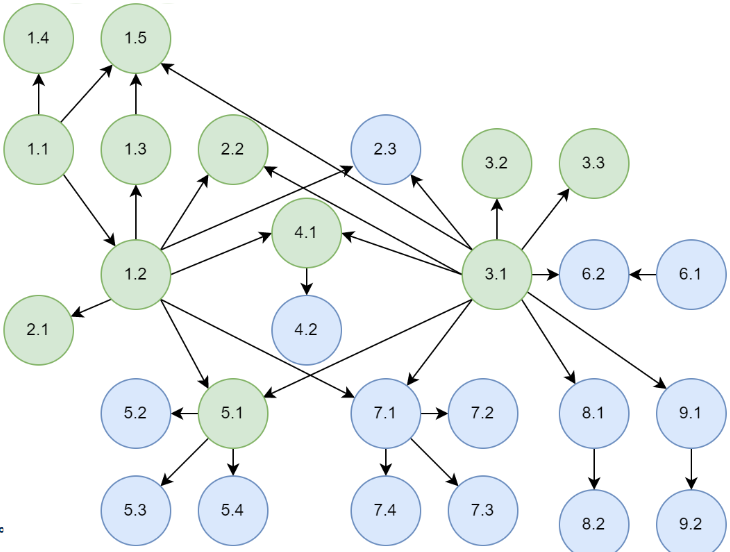

<head>
    <meta charset="UTF-8">
    <title>编译原理大作业 1 设计文档</title>
    <link rel="stylesheet" href="styles.css">
</head>

# Compiler Principle Project 1

## 1 总述

### 1.1 项目介绍

本项目使用 `C++` 实现一个类 `Rust` 语言的词法和语法分析器。

基本功能是对输入的类 `Rust` 程序实现词法和语法分析，并输出若干文件体现分析结果，采用 \<type: , value: \>@pos 格式展示词法分析后的 Token 序列，采用 AST 树的形式展示语法分析结果。



本次 **实现功能** 已经 **超出** 基本要求，1.1 - 9.2 对应的所有要求都已实现；对于后续拓展功能的某些 **羁绊**，因涉及到符号表内容暂未处理。

### 1.2 代码风格约定

为保证高效编码，小组有明确的代码风格：

1. 尽量编写 `pure function`，而不是 `non-pure function`，即函数尽量不要有副作用 (`side effects`)
2. 所有动态申请的资源使用 `std::unique_ptr<>` or `std::shared_ptr<>` 管理
3. 使用新版 `C++` 中具有更明确语义的语法或库函数
   - 如表示不一定有返回值，则使用 `std::optional<>`；表示可能有错误需要返回，则使用 `std::expected<>`
   - 对于可迭代对象，使用迭代器或者范围 `for` 遍历
   - 使用初始化列表进行初始化，统一接口
4. 接口和实现分离，即头文件中只给出 function signature，在源文件中实现
   - 内联函数在头文件中定义
5. 使用 `namespace` 管理命名空间,避免命名污染
6. 命名规则
   - 函数名：小驼峰命名法
   - 类型名：大驼峰命名法
   - 文件名和变量名：蛇形命名法
7. 尽量编写单入口单出口函数
8. 完善的测试用例

上述只是部分典型的代码风格约定，这里不再展开。

### 1.3 文件组织架构说明

```shell
.
├── build          # 目标文件目录
├── note           # 设计文档
│   └── parser.md  # 语法分析器相关设计文档
├── Makefile       # 构建文件
├── README.md
├── src            # 源代码
│   ├── include                # 头文件
│   │   ├── ast.hpp            # 抽象语法树
│   │   ├── error_reporter.hpp # 错误报告器
│   │   ├── error_type.hpp     # 错误类型编码
│   │   ├── keyword_table.hpp  # 关键字表
│   │   ├── lexer.hpp          # 词法分析器
│   │   ├── lexer_position.hpp
│   │   ├── parser.hpp         # 语法分析器
│   │   ├── preproc.hpp        # 预处理相关工具函数
│   │   ├── token.hpp          # 词法单元
│   │   ├── token_type.hpp     # 词法单元种类
│   │   └── toy_lexer.hpp      # 实际的词法分析器（派生自 lexer）
│   ├── ast.cpp
│   ├── error_reporter.cpp
│   ├── main.cpp               # 程序入口点
│   ├── parser.cpp
│   ├── preproc.cpp
│   ├── token.cpp
│   ├── token_type.cpp
│   └── toy_lexer.cpp
└── test
    │── build      # 目标文件目录
    ├── Makefile   # 测试用例构建文件
    ├── test_case  # 用于词法和语法分析器的测试用例（一组用类 Rust 词法和语法编写的程序）
    └── *.cpp      # 模块测试用例
```

## 2 总体设计

### 2.1 系统架构

本项目当前共有以下模块:

- 核心驱动模块 **main**:
  - 处理命令行参数
  - 协调各模块执行流程
  - 管理输入输出
- 词法分析模块 **Lexer**:
  - 将源代码转换为Token序列
  - 管理关键字表
  - 跟踪Token位置
  - 实现最大匹配算法和有限自动机
- 语法分析模块 **Parser**:
  - 递归下降LL(2)分析
  - 包含文法规则实现和错误处理
  - 构建抽象语法树节点
- 语法树展示模块 **AST**:
  - 定义语法树节点结构
  - 支持语法树遍历和操作
  - 提供树形结构可视化功能
- 错误报告模块 **Error Reporter**
  - 实现错误收集逻辑
  - 实现美化的错误报告 CLI UI

### 2.2 工作流程

1. `main()`函数接收命令行参数，根据参数确认输入文件 `in_file` 和输出文件 `output.token` & `output.dot`，实例化词法分析器 lexer 和语法分析器 parser。

2. `lexer`初始化一个`keyword_table` 来记录需要识别的关键词,`lexer::nextToken()`解析后续字符串,首先通过正则表达式识别 INT 和 ID 两类文法,在ID中识别各种关键词和保留字,在非 ID 和 INT 字符串中接着依次识别各种符号.

3. `parser`实现了`advance & match & check & checkAhead & expect`等工具对词法分析后的token进行匹配、检查、向前检查等操作,并从`parseProgram()` 开始对所有的非终结符节点进行递归下降分析.

4. `ast`根据parser的分析结果,将各个结点采用dot形式绘制出语法树.

5. `error reporter` 在程序词法和语法分析器工作过程中收集错误并统一报告。

## 3 词法分析详细设计

### 3.1 词法单元Token设计

#### 3.1.1 Token 数据结构设计

Token 数据结构如下，数据成员有type, value 和 pos，除关键词声明声明外，主要包含若干构造函数和运算符重载.

```cpp
class Token {
public:
    Token() = default;
    explicit Token(const Type& t, const std::string& v,
        const base::Position& p = base::Position{0, 0})
        : type(t), value(v), pos(p) {}
    Token(const Token& other) : type(other.type), value(other.value), pos(other.pos) {}
    Token(Token&& other) : type(std::move(other.type)),
        value(std::move(other.value)), pos(std::move(other.pos)) {}

    ~Token() = default;

    Token& operator=(const Token& rhs) = default;
    bool operator==(const Token& rhs) { // == 并不考虑位置！
        return this->type == rhs.type && this->value == rhs.value;
    }
public:
    inline const std::string& getValue() const {
        return this->value;
    }
    inline const Type getType() const {
        return this->type;
    }
    inline const base::Position getPos() const {
        return this->pos;
    }
    inline void setPos(const base::Position& p) {
        this->pos = p;
    }
    inline void setPos(std::size_t r, std::size_t c) {
        this->pos.row = r;
        this->pos.col = c;
    }
    const std::string toString() const;
private:
    Type           type;  // token type
    std::string    value; // 组成 token 的字符串
    base::Position pos;   // position
};
```

#### 3.1.2 Token 类型枚举定义

```cpp
// token 类型
enum class Type {
    // Group 0
    END, // end of file

    // Group 1
    ID, INT, // identifier, integer
    IF, ELSE,
    WHILE, FOR,
    I32,
    LET,
    RETURN,
    MUT,
    FN,
    IN,
    LOOP,
    BREAK, CONTINUE,

    REF,        //  &
    LPAREN,     //  (
    RPAREN,     //  )
    LBRACE,     //  {
    RBRACE,     //  }
    LBRACK,     //  [
    RBRACK,     //  ]
    SEMICOLON,  //  ;
    COLON,      //  :
    COMMA,      //  ,
    OP_PLUS,    //  +

    // Group 2
    ASSIGN,     //  =
    OP_MINUS,   //  -
    OP_MUL,     //  *
    OP_DIV,     //  /
    OP_GT,      //  >
    OP_LT,      //  <
    DOT,        //  .

    OP_EQ,      //  ==
    OP_NEQ,     //  !=
    OP_GE,      //  >=
    OP_LE,      //  <=
    DOTS,       //  ..
    ARROW,      //  ->
    SIN_COM,    //  //
    LMUL_COM,   //  /*
    RMUL_COM    //  */
};
```

### 3.2 词法分析器Lexer实现

#### 3.2.1 关键字表实现

关键字表包含一个unordered_map哈希表结构,外部可以通过传入name获得对应的Token,这里的Token是 **class Token**中已经定义好的关键字.

```cpp
/**
 * @brief   关键字表
 * @details 内置一个存储所有关键字的 hash map，用于查找判断指定 token 是否为关键字
 */
class KeywordTable {
public:
    KeywordTable()  = default;
    ~KeywordTable() = default;
public:
    inline bool iskeyword(std::string v) const {
        return (keywords.find(v) != keywords.end());
    }
    token::Type getKeyword(std::string v) const {
        std::ostringstream oss;
        if (keywords.find(v) == keywords.end()) {
            oss << "调用参数（" << v << "）并非关键字";
            reporter->report(
                error::InternalErrorType::UnknownKeyword,
                oss.str()
            );
        }
        return keywords.find(v)->second;
    }
    inline void addKeyword(std::string n, token::Type t) {
        this->keywords.emplace(n, t);
    }
    inline void setErrReporter(std::shared_ptr<error::ErrorReporter> reporter) {
        this->reporter = std::move(reporter);
    }
private:
    std::shared_ptr<error::ErrorReporter>        reporter; // error reporter
    std::unordered_map<std::string, token::Type> keywords; // keyword hash map
};
```

Lexer 在初始化时构造关键词表,供后续词法分析使用.

```cpp
void ToyLexer::initKeywordTable(void) {
    using token::Token;
    keyword_table.addKeyword("if",       Token::IF);
    keyword_table.addKeyword("fn",       Token::FN);
    keyword_table.addKeyword("in",       Token::IN);
    keyword_table.addKeyword("i32",      Token::I32);
    keyword_table.addKeyword("let",      Token::LET);
    keyword_table.addKeyword("mut",      Token::MUT);
    keyword_table.addKeyword("for",      Token::FOR);
    keyword_table.addKeyword("loop",     Token::LOOP);
    keyword_table.addKeyword("else",     Token::ELSE);
    keyword_table.addKeyword("break",    Token::BREAK);
    keyword_table.addKeyword("while",    Token::WHILE);
    keyword_table.addKeyword("return",   Token::RETURN);
    keyword_table.addKeyword("continue", Token::CONTINUE);
    this->keyword_table.setErrReporter(this->reporter);
}
```

#### 3.2.2 有限自动机设计


#### 3.2.3有限自动机实现

step 1: 采用std::regex库使用正则表达式匹配INT和ID类.

```cpp
static const std::vector<std::pair<token::Type, std::regex>> patterns {
    {token::Type::ID,  std::regex{R"(^[a-zA-Z_]\w*)"}},
    {token::Type::INT, std::regex{R"(^\d+)"}}
};
```

step 2: 若匹配到ID,检查是否为关键词.

```cpp
std::string view {this->text[this->pos.row].substr(this->pos.col)};
for (const auto& [type, expression] : patterns) {
    std::smatch match;
    if (std::regex_search(view, match, expression)) {
        auto p = this->pos;
        shiftPos(match.length(0));
        if (type == token::Type::ID && this->keyword_table.iskeyword(match.str(0))) {
            auto keyword_type = this->keyword_table.getKeyword(match.str(0));
            return Token{keyword_type, match.str(0), p};
        }
        return Token{type, match.str(0), p};
    }
}
```

step 3: 依次匹配剩余符号,包括单字符和双字符组合,优先匹配双字符.

```cpp
Token token       {};        // 识别到的词法单元
char  first_char  {view[0]}; // 当前看到的第一个字符
char  second_char {view.length() > 1 ? view[1] : '\0'}; // 当前看到的第二个字符 - 用于 lookahead

// 检测算符和标点符号
switch (first_char) {
default:
    break;
case '(':
    token = Token{token::Type::LPAREN, std::string{"("}};
    break;
case ')':
    token = Token{token::Type::RPAREN, std::string{")"}};
    break;
case '{':
    token = Token{token::Type::LBRACE, std::string{"{"}};
    break;
case '}':
    token = Token{token::Type::RBRACE, std::string{"}"}};
    break;
case '[':
    token = Token{token::Type::LBRACK, std::string{"["}};
    break;
case ']':
    token = Token{token::Type::RBRACK, std::string{"]"}};
    break;
case ';':
    token = Token{token::Type::SEMICOLON, std::string{";"}};
    break;
case ':':
    token = Token{token::Type::COLON, std::string{":"}};
    break;
case ',':
    token = Token{token::Type::COMMA, std::string{","}};
    break;
case '+':
    token = Token{token::Type::OP_PLUS, std::string{"+"}};
    break;
case '=':
    if (second_char == '='){
        token = Token{token::Type::OP_EQ, std::string{"=="}};
    } else {
        token = Token{token::Type::ASSIGN, std::string{"="}};
    }
    break;
case '-':
    if (second_char == '>'){
        token = Token{token::Type::ARROW, std::string{"->"}};
    } else {
        token = Token{token::Type::OP_MINUS, std::string{"-"}};
    }
    break;
case '*':
    if (second_char == '/'){
        token = Token{token::Type::RMUL_COM, std::string{"*/"}};
    } else {
        token = Token{token::Type::OP_MUL, std::string{"*"}};
    }
    break;
case '/':
    if (second_char == '/'){
        token = Token{token::Type::SIN_COM, std::string{"//"}};
    } else if (second_char == '*'){
        token = Token{token::Type::LMUL_COM, std::string{"/*"}};
    } else {
        token = Token{token::Type::OP_DIV, std::string{"/"}};
    }
    break;
case '>':
    if (second_char == '=') {
        token = Token{token::Type::OP_GE, std::string{">="}};
    } else {
        token = Token{token::Type::OP_GT, std::string{">"}};
    }
    break;
case '<':
    if (second_char == '='){
        token = Token{token::Type::OP_LE, std::string{"<="}};
    } else {
        token = Token{token::Type::OP_LT, std::string{"<"}};
    }
    break;
case '.':
    if(second_char == '.'){
        token = Token{token::Type::DOTS, std::string{".."}};
    } else{
        token = Token{token::Type::DOT, std::string{"."}};
    }
    break;
case '!':
    if(second_char == '='){
        token = Token{token::Type::OP_NEQ, std::string{"!="}};
    }
    break;
case '&':
    token = Token{token::Type::Ref, std::string{"&"}};
    break;
}

token.setPos(this->pos);
if (!token.getValue().empty()) {
    this->pos += token.getValue().length();
    return token;
}

base::Position p = this->pos;
std::size_t idx = 0;
for (; idx < view.length(); ++idx) {
    if (std::isspace(view[idx])) {
        break;
    }
}
shiftPos(idx);

return std::unexpected(error::LexError{
    error::LexErrorType::UnknownToken,
    "识别到未知的 token: " + view.substr(0, idx),
    p.row,
    p.col,
    view.substr(0, idx)
});
```

#### 3.2.4 位置信息跟踪

在 `lexer` 中定义了数据成员 `pos` 记录当前分析到的代码位置，从而获取位置信息并对每个 token 赋予位置信息。

### 3.3 词法错误处理

在我们的设计中，词法分析只有识别到未知 token 错误。在实现上，会在分析完代码后，统一报告 UnknownToken 错误。

效果如下图所示：


<br>

## 4 语法分析详细设计

### 4.1 文法设计

#### 4.1.1 类RUST语言的文法定义

采用LL(2)兼容的上下文无关文法（CFG），核心规则如下：

```shell
Prog        → Decl*
Decl        → FuncDecl
FuncDecl    → "fn" ID "(" Args ")" ("->" VarType)? BlockStmt
Args        → (Arg ("," Arg)*)?
Arg         → ("mut")? ID ":" VarType
BlockStmt   → "{" Stmt* "}"
Stmt        → VarDeclStmt | AssignStmt | IfStmt | WhileStmt | ...
Expr        → FuncExprBlockStmt | IfExpr | LoopStmt | CmpExpr
```

实际实现的产生式如下：

```shell
Prog -> (FuncDecl)*
FuncDecl -> FuncHeaderDecl BlockStmt
BlockStmt -> FuncExprBlockStmt
FuncHeaderDecl -> "fn" "\<ID\>" "(" (arg ("," arg)*)? ")" ("->" VarType)?
arg -> VarDeclBody ":" VarType
VarDeclBody -> ("mut")? "\<ID\>"
VarType -> (["&" | "&" "mut"])? [Integer | Array | Tuple]
Integer -> "i32"
Array -> "[" VarType ";" "\<INT\>" "]"
Tuple -> "(" (VarType ",")+ (VarType)? ")"
BlockStmt -> "{" (Stmt)* "}"
FuncExprBlockStmt -> "{" (Stmt)* Expr "}"
Stmt -> VarDeclStmt | RetStmt | CallExpr | AssignStmt | ExprStmt | IfStmt | WhileStmt | ForStmt | LoopStmt | BreakStmt | ContinueStmt | NullStmt
VarDeclStmt -> "let" ("mut")? "\<ID\>" (":" VarType)? ("=" Expr)? ";"
RetStmt -> "return" (CmpExpr)? ";"
CallExpr -> "\<ID\>" "(" (arg ("," arg)*)? ")"
AssignStmt -> AssignElement "=" Expr ";"
AssignElement -> Deference | ArrayAccess | TupleAccess | Variable
Deference -> "*" "\<ID\>"
ArrayAccess -> "\<ID\>" "[" Expr "]"
TupleAccess -> "\<ID\>" "." "\<INT\>"
Variable -> "\<ID\>"
ExprStmt -> Expr ";"
IfStmt -> "if" CmpExpr BlockStmt (ElseClause)*
ElseClause -> "else" ("if" Expr)? BlockStmt
WhileStmt -> "while" CmpExpr BlockStmt
ForStmt -> "for" VarDeclBody "in" CmpExpr ".." CmpExpr BlockStmt
LoopStmt -> "loop" BlockStmt
BreakStmt -> "break" (Expr)? ";"
ContinueStmt -> "continue" ";"
NullStmt -> ";"
Expr -> FuncExprBlockStmt | IfExpr | loopExpr | CmpExpr
CmpExpr -> AddExpr ([\< | \<= | \> | \>= | == | !=] AddExpr)*
AddExpr -> MulExpr ([+ | -] MulExpr)*
MulExpr -> Factor ([\* | /] Factor)*
Factor -> ArrayElements | TupleElements | (["&" | "&" "mut"])? Element | ParenthesisExpr
ArrayElements -> "[" Expr ("," Expr)* "]"
TupleElements -> "(" (Expr ",")+ (Expr)? ")"
Element -> ParenthesisExpr | "\<INT\>" | AssignElement | CallExpr | Variable
ParenthesisExpr -> "(" CmpExpr ")"
IfExpr -> "if" Expr FuncExprBlockStmt "else" FuncExprBlockStmt
```

#### 4.1.2 消除左递归

产生式左递归主要出现在Expr相关内容：

```shell
3.2 表达式增加计算和比较（前置规则 3.1）:

Expr -> Expr [\< | \<= | \> | \>= | == | !=] AddExpr
AddExpr -> AddExpr [+ | -] Item
Item -> Item [\* | /] Factor
```

我们采用分层处理优先级方法实现Expr并消除左递归：

```shell
Expr -> FuncExprBlockStmt | IfExpr | loopExpr | CmpExpr
CmpExpr -> AddExpr ([\< | \<= | \> | \>= | == | !=] AddExpr)*
AddExpr -> MulExpr ([+ | -] MulExpr)*
MulExpr -> Factor ([\* | /] Factor)*
Factor -> ArrayElements | TupleElements | (["&" | "&" "mut"])? Element | ParenthesisExpr
```

#### 4.1.3 通过vector实现右递归减少递归层数

以 `Args → (Arg ("," Arg)*)?` 为例,采用vector来代替右递归.

```cpp
std::vector<ast::ArgPtr> argv {};
while(!check(TokenType::RPAREN)) {
    argv.push_back(parseArg());
    if (!check(TokenType::COMMA)) {
        break;
    }
    advance();
}
```

### 4.2 语法分析器Parser实现

#### 4.2.1 Token流管理

```cpp
class Parser {
private:
    void advance();
    bool match(lexer::token::Type type);
    bool check(lexer::token::Type type) const;
    bool checkAhead(lexer::token::Type type);
    void expect(lexer::token::Type type, const std::string& error_msg);

private:
    std::shared_ptr<error::ErrorReporter> reporter; // error reporter
    std::function<std::expected<lexer::token::Token, error::LexError>()> nextTokenFunc; // 获取下一个 token
    lexer::token::Token                current;   // 当前看到的 token
    std::optional<lexer::token::Token> lookahead; // 往后看一个 token
};
```

采用**三明治模型**管理Token:

- current 表示当前token
- lookahead 表示预读token
- nextTokenFunc 接收lexer::nextToken()

主要方法有：`advance`, `match`, `check`, `checkAhead`, `expect`，这些方法为词法分析提供必要功能，详见下面注释与代码：

```cpp
/**
 * @brief 向前扫描一个 token
 */
void Parser::advance() {
    if (lookahead.has_value()) {
        current = lookahead.value();
        lookahead.reset(); // 清除 lookahead 中的值
    } else {
        if (auto token = nextTokenFunc();
            token.has_value()) {
            current = token.value();
        } else { // 如果识别到未知 token，则发生了词法分析错误，且需要立即终止
            reporter->report(token.error(), true);
        }
    }
}

/**
 * @brief  匹配当前 token，并向前扫描一个 token
 * @param  type 需匹配的 token 类型
 * @return 是否成功匹配
 */
bool Parser::match(lexer::token::Type type) {
    if (check(type)) {
        advance();
        return true;
    }
    return false;
}

/**
 * @brief  检查当前看到的 token 是否存在，如果存在判断其类型是否为给定值
 * @param  type 指定的 token 类型
 * @return 是否通过检查
 */
bool Parser::check(lexer::token::Type type) const {
    return current.getType() == type;
}

/**
 * @brief  向前检查一个 token，判断其类型是否为给定值
 * @param  type 指定的 token 类型
 * @return 是否通过检查
 */
bool Parser::checkAhead(lexer::token::Type type) {
    if (!lookahead.has_value()) {
        if (auto token = nextTokenFunc();
            token.has_value()) {
            lookahead = token.value(); // 获取下一个 token
        } else { // 如果识别到未知 token，则发生了词法分析错误，且需要立即终止
            reporter->report(token.error(), true);
        }
    }
    return lookahead.has_value() && lookahead->getType() == type;
}

/**
 * @brief 匹配期望的 token，如果未匹配成功则抛出 runtime error
 * @param type 期望的 token 类型
 * @param msg  错误信息
 */
void Parser::expect(lexer::token::Type type, const std::string& msg) {
    if (!match(type)) {
        reporter->report(
            error::ParseErrorType::UnexpectToken,
            msg,
            current.getPos().row,
            current.getPos().col,
            current.getValue()
        );
    }
}
```

#### 4.2.2 LL(2)解析器设计

##### 递归下降解析

对于每个非终结符,都有对应的解析函数.

```cpp
ast::ProgPtr              parseProgram();
ast::FuncDeclPtr          parseFuncDecl();
ast::FuncHeaderDeclPtr    parseFuncHeaderDecl();
ast::NodePtr              parseStmtOrExpr();
ast::BlockStmtPtr         parseBlockStmt();
ast::RetStmtPtr           parseRetStmt();
ast::ArgPtr               parseArg();
ast::VarDeclStmtPtr       parseVarDeclStmt();
ast::AssignStmtPtr        parseAssignStmt(ast::AssignElementPtr&&);
ast::AssignElementPtr     parseAssignElement();
ast::ExprPtr              parseExpr(std::optional<ast::AssignElementPtr>);
ast::ExprPtr              parseCmpExpr(std::optional<ast::AssignElementPtr>);
ast::ExprPtr              parseAddExpr(std::optional<ast::AssignElementPtr>);
ast::ExprPtr              parseMulExpr(std::optional<ast::AssignElementPtr>);
ast::ExprPtr              parseFactor(std::optional<ast::AssignElementPtr>);
ast::ExprPtr              parseElementExpr(std::optional<ast::AssignElementPtr>);
ast::CallExprPtr          parseCallExpr();
ast::IfStmtPtr            parseIfStmt();
ast::ElseClausePtr        parseElseClause();
ast::WhileStmtPtr         parseWhileStmt();
ast::ForStmtPtr           parseForStmt();
ast::LoopStmtPtr          parseLoopStmt();
ast::VarTypePtr           parseVarType();
ast::FuncExprBlockStmtPtr parseFuncExprBlockStmt();
ast::IfExprPtr            parseIfExpr();
ast::BreakStmtPtr         parseBreakStmt();
```

每个函数的返回值都是 AST 结点，每个非终结符都有各自的解析函数，顶层是 `parseProgram()` 外部调用，由此逐层向下递归分析整个程序。

##### 解析函数示例

由于这些函数比较复杂,所以只展示几个代表性函数的实现.

```cpp
/**
 * @brief  解析函数头声明
 * @return ast::FuncHeaderDeclPtr - AST Function Header Declaration 结点指针
 */
[[nodiscard]]
ast::FuncHeaderDeclPtr Parser::parseFuncHeaderDecl() {
    // FuncHeaderDecl -> fn <ID> ( (arg)* ) (-> VarType)?
    using TokenType = lexer::token::Type;

    expect(TokenType::FN, "此处期望有一个 'fn'");

    std::string name = current.getValue(); // function name
    expect(TokenType::ID, "此处期望有一个 '<ID>' 作为函数名");

    expect(TokenType::LPAREN, "此处期望有一个 '('");

    std::vector<ast::ArgPtr> argv {};
    while(!check(TokenType::RPAREN)) {
        argv.push_back(parseArg());
        if (!check(TokenType::COMMA)) {
            break;
        }
        advance();
    }

    expect(TokenType::RPAREN, "Expected ')'");

    if (check(TokenType::ARROW)) {
        expect(TokenType::ARROW, "Expected '->'");
        auto type = parseVarType();
        return std::make_shared<ast::FuncHeaderDecl>(std::move(name), std::move(argv), std::move(type));
    }
    return std::make_shared<ast::FuncHeaderDecl>(std::move(name), std::move(argv), std::nullopt);
}
```

`Parser::parseFuncHeaderDecl()`实现的就是函数头对应`FuncHeaderDecl -> fn <ID> ( Args )`和`FuncHeaderDecl -> fn <ID> ( Args ) -> VarType` 两条产生,该函数可以体现出解析器的实现特点：

1. 充分利用具有错误提示的`expect`来实现 Token 匹配.
2. `advance()`通常与 if/while (check()) 结合使用,来实现一个非终结符多条产生式的不同分支情况,来实现LL(1).
3. 对于右递归,如 Args 的解析,就会充分使用std::vector来操作.


```cpp
/**
 * @brief  解析语句或表达式
 * @return ast::NodePtr - Stmt 或 Expr 结点指针
 */
[[nodiscard]]
ast::NodePtr Parser::parseStmtOrExpr() {
    using TokenType = lexer::token::Type;

    ast::StmtPtr stmt {};
    if (check(TokenType::LET)) {
        stmt = parseVarDeclStmt();
    } else if (check(TokenType::RETURN)) {
        stmt = parseRetStmt();
    } else if (check(TokenType::ID) || check(TokenType::OP_MUL)) {
        if (check(TokenType::ID) && checkAhead(TokenType::LPAREN)) {
            return parseCallExpr();
        }
        /*
         * x, *x, x[idx], x.idx 都即可以作为赋值语句的左值，
         * 又可以作为表达式的一个操作数
         */
        auto elem = parseAssignElement();
        if (check(TokenType::ASSIGN)) {
            stmt =  parseAssignStmt(std::move(elem));
        } else {
            return parseExpr(elem);
        }
    } else if (check(TokenType::INT) || check(TokenType::LPAREN)) {
        return parseExpr();
    } else if (check(TokenType::IF)) {
        stmt = parseIfStmt();
    } else if (check(TokenType::WHILE)) {
        stmt = parseWhileStmt();
    } else if (check(TokenType::FOR)) {
        stmt = parseForStmt();
    } else if (check(TokenType::LOOP)) {
        stmt = parseLoopStmt();
    } else if (check(TokenType::BREAK)) {
        stmt = parseBreakStmt();
    } else if (check(TokenType::CONTINUE)) {
        stmt = std::make_shared<ast::ContinueStmt>();
        advance();
        expect(TokenType::SEMICOLON,"Expected ';' after Continue");
    } else if (check(TokenType::SEMICOLON)){
        stmt = std::make_shared<ast::NullStmt>();
        advance();
    }

    return stmt;
}
```

`Parser::parseStmtOrExpr()`是整个语法分析器中非常重要的函数,因为单个Statement是程序中最复杂的单位,需要充分的前向搜索来确定下一步调用的是哪个解析函数,而这里就使用了checkAhead来实现LL(2).

### 4.3 语法错误处理

时间原因，语法错误并没有如词法错误一样实现健全的错误报告机制。而是使用了 `C++` 的标准异常处理机制，即使用 `throw` 抛出 `std::runtime_error` 的方式来进行。因此语法错误会导致程序异常退出。

## 5 AST详细设计

### 5.1 AST节点设计

在本项目中，我们为语言的各类语句与表达式设计了一套`结构化、面向对象的抽象语法树（AST）节点体系`。每类语法成分均对应一个派生自抽象基类 `Stmt` 或 `Expr` 的具体节点结构，并通过智能指针统一管理节点生命周期，便于后续分析与可视化处理。

#### 5.1.1 设计原则

1. `语法对齐`：每种语言结构均映射为一个对应的 AST 节点类，确保语法到语义结构的准确还原。

2. `层次分明`：节点之间通过组合表达语义层级。

3. `类型枚举分发`：每个节点实现 type() 方法，返回 NodeType 枚举值，用于类型匹配与动态分发。

4. `可视化友好`：节点设计天然支持转为可视化结构 `DOT` 格式,用于调试与展示。

#### 5.1.2 节点类型

根据上述实际实现的产生式，对不同类型的节点予以定义，由于本次 **实现功能** 已经 **超出** 基本要求，1.1 - 9.2 所有要求都已经实现，在AST节点定义中便以给出所有要求所需要的节点类型。

- `基础节点类型`
  - Prog：程序入口，包含所有顶层声明。
  - Decl：通用声明类型，是函数声明等的基类。
  - Stmt：语句基类。
  - Expr：表达式基类。
  - VarType：变量类型（如 int、int[]、(int, int)）。
  - Arg：函数参数节点。

- `声明与语句类节点`
  - FuncDecl：函数定义，包括头部和主体。
  - FuncHeaderDecl：函数头，包含名称、返回类型与参数。
  - BlockStmt：语句块，表示 { ... }。
  - ExprStmt：表达式语句。
  - RetStmt：返回语句。
  - VarDeclStmt：变量声明。
  - AssignStmt：赋值语句。
  - VarDeclAssignStmt：声明并赋值语句。
  - IfStmt：if 条件语句，包含多个 ElseClause。
  - ElseClause：if 的 else 或 else-if 子句。
  - WhileStmt：while 循环语句。
  - ForStmt：for 循环语句。
  - LoopStmt：无限循环语句。
  - BreakStmt：中断语句。
  - ContinueStmt：跳过语句。
  - NullStmt：空语句 ;
- `表达式类节点`
  - Number：数字常量。
  - Factor：因子节点，表达式的基本单位。
  - ComparExpr：比较表达式。
  - ArithExpr：算术表达式。
  - CallExpr：函数调用表达式。
  - ParenthesisExpr：括号表达式。
  - FuncExprBlockStmt：匿名函数表达式（带语句块）。
  - IfExpr：条件表达式（if 表达式）。
  - ArrayElements：数组元素列表。
  - TupleElements：元组元素列表。
- `类型节点`
  - Integer：整数类型。
  - Array：数组类型。
  - Tuple：元组类型。
- `左值与访问节点`
  - Variable：变量。
  - Dereference：解引用。
  - ArrayAccess：数组访问（如 a[i]）。
  - TupleAccess：元组访问（如 t.0）。

各节点通过重写 `NodeType type() const` 方法实现运行时类型识别，并支持向下转型操作，以支持语法结构分析与转换。

### 5.2 AST构建

抽象语法树（AST）的构建是在语法分析阶段完成的。每一种语法结构都对应一个具体的 AST 节点类型，这些节点都派生自统一的基类 `Node`。节点的构造过程与语法规则一一对应，在语法匹配的过程中由递归下降分析器动态生成。

整个 AST 结构通过智能指针组织为`一棵具有层级关系的树`，能够完整表达源代码的语法与语义结构。下面是 AST 中基础与关键结构体的定义的示例：

- `基础节点类型定义`
```cpp
// 所有 AST 结点的基类
struct Node {
    virtual constexpr NodeType type() const = 0;
    virtual ~Node() = default;
};
using NodePtr = std::shared_ptr<Node>;
```
- `程序入口节点定义`
```cpp
// Program
struct Prog : Node {
    std::vector<DeclPtr> decls; // declarations

    Prog() = default;
    explicit Prog(const std::vector<DeclPtr>& ds) : decls(ds) {}
    explicit Prog(std::vector<DeclPtr>&& ds) : decls(std::move(ds)) {}

    constexpr NodeType type() const override { return NodeType::Prog; }
};
using  ProgPtr = std::shared_ptr<Prog>;
```
- `声明节点基类`
```cpp
// Declaration 节点
struct Decl : Node {
    constexpr NodeType type() const override { return NodeType::Decl; }
    virtual ~Decl() = default;
};
using DeclPtr = std::shared_ptr<Decl>;

// Variable Type
struct VarType : Node {
    RefType ref_type = RefType::Normal;

    VarType() = default;
    explicit VarType(RefType rt) : ref_type(rt) {}
    virtual ~VarType() = default;

    constexpr NodeType type() const override { return NodeType::VarType; }
};
using  VarTypePtr = std::shared_ptr<VarType>;

// Argument
struct Arg : Node {
    VarDeclBodyPtr variable; // variable
    VarTypePtr     var_type; // variable type

    Arg() = default;
    explicit Arg(const VarDeclBodyPtr& var, const VarTypePtr& vt) : variable(var), var_type(vt) {}
    explicit Arg(VarDeclBodyPtr&& var, VarTypePtr&& vt)
        : variable(std::move(var)), var_type(std::move(vt)) {}

    constexpr NodeType type() const override { return NodeType::Arg; }
};
using  ArgPtr = std::shared_ptr<Arg>;

// Statement
struct Stmt : Node {
    virtual ~Stmt() = default;
    constexpr NodeType type() const override { return NodeType::Stmt; }
};
using  StmtPtr = std::shared_ptr<Stmt>;
```

- `函数头声明节点`
```cpp
// Function header declaration
struct FuncHeaderDecl : Decl {
    std::string               name;        // 函数名
    std::vector<ArgPtr>       argv;        // 参数列表
    std::optional<VarTypePtr> retval_type; // 返回类型

    FuncHeaderDecl() = default;
    explicit FuncHeaderDecl(const std::string& n, const std::vector<ArgPtr>& av, const std::optional<VarTypePtr>& rt)
        : name(n), argv(av), retval_type(rt) {}
    explicit FuncHeaderDecl(std::string&& n, std::vector<ArgPtr>&& av, std::optional<VarTypePtr>&& rt)
        : name(std::move(n)), argv(std::move(av)), retval_type(std::move(rt)) {}

    constexpr NodeType type() const override { return NodeType::FuncHeaderDecl; }
};
using FuncHeaderDeclPtr = std::shared_ptr<FuncHeaderDecl>;
```
下面按照逻辑模块进行分层展示各节点之间的结构与类别：
```shell
Node
├── Prog
├── Arg
├── Decl
│   ├── FuncDecl
│   ├── VarDeclStmt
│   │   └── VarDeclAssignStmt
│   └── FuncHeaderDecl
├── Stmt
│   ├── BlockStmt
│   │   └── FuncExprBlockStmt
│   ├── ExprStmt
│   ├── RetStmt
│   ├── VarDeclStmt
│   │   └── VarDeclAssignStmt
│   ├── AssignStmt
│   ├── VarDeclAssignStmt
│   ├── ElseClause
│   ├── IfStmt
│   ├── WhileStmt
│   ├── ForStmt
│   ├── LoopStmt
│   ├── BreakStmt
│   ├── ContinueStmt
│   └── NullStmt
├── Expr
│   ├── Number
│   ├── Factor
│   ├── ComparExpr
│   ├── ArithExpr
│   ├── CallExpr
│   ├── ParenthesisExpr
│   ├── FuncExprBlockStmt
│   ├── LoopStmt
│   ├── IfExpr
│   ├── ArrayElements
│   └── TupleElements
├── VarType
│   ├── Integer
│   ├── Array
│   └── Tuple
├── VarDeclBody
├── AssignElement
│   ├── Variable
│   ├── Dereference
│   ├── ArrayAccess
│   └── TupleAccess
└──

```
### 5.3 AST可视化

#### 5.3.1 AST 转 DOT 格式函数

为了实现 AST 的可视化展示，设计了统一的导出接口 `ast2Dot`，用于遍历整个语法树并输出 DOT 图格式内容，结构如下：

```cpp
/**
 * @brief   将抽象语法树转换为 dot 格式，并输出到文件
 * @param   out 输出流对象
 * @param   prog 程序的抽象语法树指针
 * @return  void
 */
void ast2Dot(std::ofstream& out, const ProgPtr& prog) {
    out << "digraph AST {" << std::endl
        << "    node [shape=ellipse, fontname=\"Courier\"]" << std::endl << std::endl
        << "    // define nodes" << std::endl;

    DotNodeDecl n_prog = str2NodeDecl("Prog");

    std::ostringstream oss_nd;
    std::ostringstream oss_ed;

    oss_nd << nodeDecls2Str(n_prog);
    for (const auto& decl : prog->decls) {
        assert(std::dynamic_pointer_cast<FuncDecl>(decl));
        auto [n_fd, fd_nd, fd_ed] = funcDecl2Dot(std::dynamic_pointer_cast<FuncDecl>(decl));
        oss_nd << fd_nd;
        oss_ed << edge2Str(n_prog, n_fd) << fd_ed;
    }

    out << oss_nd.str() << std::endl
        << "    // define edges" << std::endl
        << oss_ed.str() << std::endl
        << "}" << std::endl;
}
```

此函数中核心流程：
1. 创建根节点 Prog
2. 遍历每个函数声明 FuncDecl
3. 调用 funcDecl2Dot 将其转为节点描述与边描述
4. 最终统一输出所有节点与边

#### 5.3.2 DOT 结点声明与生成

在 AST 可视化过程中，我们需要将抽象语法树中的每个语法结点转换为 DOT 图的结点，以便后续图形化展示。为此，定义了一个 `DotNodeDecl` 结构体用于表示 DOT 语言中的图结点，其设计如下所示：

```cpp
struct DotNodeDecl {
    std::string name  {}; // 结点名 - 唯一，用于区分不同结点
    std::string label {}; // 标签 - 不唯一，用于图片显示

    DotNodeDecl() = default;
    explicit DotNodeDecl(const std::string& n, const std::string& l)
        : name(n), label(l) {}
    explicit DotNodeDecl(std::string&& n, std::string&& l)
        : name(std::move(n)), label(std::move(l)) {}

    ~DotNodeDecl() = default;

    inline bool initialized() const { return name.length() > 0 && label.length() > 0; }
    inline std::string toString() const { return name + label; }
};
```
该结构体包含以下两个核心字段：

- `name`：用于标识结点的唯一名称，在 DOT 文件中每个结点必须具有唯一标识；
- `label`：用于图形化展示时的标签名称，支持相同类型的多个结点使用相同标签。

这个结构体作为 DOT 图生成的基础，支撑了整个 AST 向图形结构的映射过程，是可视化模块的重要组成部分。

为了简化结点的构造过程，我们进一步封装了如下函数 `str2NodeDecl`：
```cpp
/**
 * @brief  通过名称构造带编号的 DOT 节点声明
 * @param  s std::string 节点名称
 * @return DotNodeDecl
 */
static DotNodeDecl str2NodeDecl(const std::string& s) {
    std::ostringstream oss;
    oss << s << cnt++; // 确保唯一性
    std::string name  {oss.str()},
                label {"[label = \"" + s + "\"]"};

    return DotNodeDecl{name, label};
}
```

该函数实现的关键在于通过`全局计数器 cnt `自动为结点名称添加编号后缀，从而确保 DOT 图中每个结点名称的唯一性。同时，它统一封装了 DOT 标签的构造逻辑，返回标准的 DotNodeDecl 对象，方便在遍历 AST 过程中直接调用使用。

#### 5.3.3 DOT 结构化输出函数

在完成 AST 向 DotNodeDecl 的转换后，为便于构造完整的 DOT 图文件，还需要将结点与边统一转化为符合 DOT 语法的字符串。为此，设计了如下辅助函数：

1. `DOT 结点列表转字符串`
```cpp
/**
 * @brief  将一系列 DOT 结点声明转换为字符串
 * @param  nd 变长参数
 * @return std::string
 */
template<typename... T> // 变长参数模板
static std::string nodeDecls2Str(const T&... nd) {
    static_assert((std::is_same_v<T, DotNodeDecl> && ...),
        "All arguments must be DotNodeDecl"); // 编译期检查，未通过则编译出错

    std::ostringstream oss;
    ((oss << "    " << nd.toString() << std::endl), ...); // 左折叠展开

    return oss.str();
}
```
这个函数支持变长参数，允许传入多个 DotNodeDecl 类型的结点，并在编译期进行类型检查，保证类型安全。输出格式符合 DOT 图的结点声明规范。

2. `DOT 边的单条转换`
```cpp
/**
 * @brief  将一系列 DOT 结点声明转换为字符串
 * @param  nd 变长参数
 * @return std::string
 */
template<typename... T> // 变长参数模板
static std::string nodeDecls2Str(const T&... nd) {
    static_assert((std::is_same_v<T, DotNodeDecl> && ...),
        "All arguments must be DotNodeDecl"); // 编译期检查，未通过则编译出错

    std::ostringstream oss;
    ((oss << "    " << nd.toString() << std::endl), ...); // 左折叠展开

    return oss.str();
}
```

这个函数用于生成单条边的 DOT 表达式，形式为 A -> B，符合 DOT 语言的语义连接规范。

3. `多条边的批量转换`
```cpp
/**
 * @brief  将边列表转换为 DOT 格式字符串
 * @param  edges 边的起点和终点节点对列表
 * @return 表示所有边的字符串，每行一条 DOT 边语句
 */
static std::string edges2Str(std::initializer_list<std::pair<DotNodeDecl, DotNodeDecl>> edges) {
    std::ostringstream oss;

    for(auto edge : edges) {
        oss << "    " << edge.first.name << " -> " << edge.second.name << std::endl;
    }

    return oss.str();
}
```
这个函数支持通过初始化列表批量生成边声明，适用于构造多个子节点连接场景，常配合 AST 遍历使用以构建完整图结构。

以上函数共同构成了 AST 可视化中 DOT 输出模块的核心逻辑，配合 DotNodeDecl 结构体与生成函数，可高效构建语法树的图形化表示。

4. `AST 结点辅助构造函数`

在生成 DOT 图的过程中，除了需要将 AST 的结构节点转换为 DOT 格式节点外，还需要将具体的词法标记（Token）作为图中叶子节点进行可视化表示。为此，定义了辅助函数 tokenType2NodeDecl：

```cpp
/**
 * @brief  通过 token type 构造 DOT 结点声明
 * @param  t token type
 * @return DotNodeDecl
 */
static DotNodeDecl tokenType2NodeDecl(lexer::token::Type t) {
    using TokenType = lexer::token::Type;
    static const std::unordered_map<TokenType, std::string> map {
        {TokenType::REF,       "&"},
        {TokenType::LPAREN,    "("},
        {TokenType::RPAREN,    ")"},
        {TokenType::LBRACE,    "{"},
        {TokenType::RBRACE,    "}"},
        {TokenType::LBRACK,    "["},
        {TokenType::RBRACK,    "]"},
        {TokenType::SEMICOLON, ";"},
        {TokenType::COLON,     ":"},
        {TokenType::COMMA,     ","},
        {TokenType::ASSIGN,    "="},
        {TokenType::DOT,       "."},
        {TokenType::DOTS,      ".."},
        {TokenType::ARROW,     "->"},
        {TokenType::IF,        "if"},
        {TokenType::ELSE,      "else"},
        {TokenType::WHILE,     "while"},
        {TokenType::OP_PLUS,   "+"},
        {TokenType::OP_MINUS,  "-"},
        {TokenType::OP_MUL,    "*"},
        {TokenType::OP_DIV,    "/"},
        {TokenType::OP_EQ,     "=="},
        {TokenType::OP_NEQ,    "!="},
        {TokenType::OP_LT,     "<"},
        {TokenType::OP_LE,     "<="},
        {TokenType::OP_GT,     ">"},
        {TokenType::OP_GE,     ">="}
    };

    if (map.find(t) == map.end()) {
        throw std::runtime_error{"tokenType2NodeDecl(): Unknown Token Type."};
    }

    std::ostringstream oss;
    oss << lexer::token::tokenType2str(t) << cnt++;
    std::string name {oss.str()},
                label = "[label = \"" + map.find(t)->second + "\"]";

    return DotNodeDecl{name, label};
}
```
这个函数是连接词法分析器输出与 AST 可视化的重要桥梁，提升了图形展示的清晰度与一致性。

#### 5.3.4 AST 转 DOT 转换示例

本节以具体语法结构为例，展示如何将 AST 中的结点及其子结构转换为 DOT 图的格式。以下选取了两个典型的转换函数：通用语句 Stmt 结点和函数头声明 FuncHeaderDecl 结点。

##### 通用语句 Stmt 转换

语句结构复杂多样，统一使用分发函数 stmt2Dot 进行处理，根据语句类型选择具体转换逻辑：
```cpp
/**
 * @brief   将语句 Stmt 转 dot 格式，根据type来进行分发
 * @param   stmt AST 语句结点指针
 * @return  [根节点的 DotNodeDecl, 结点声明串, 边声明串]
 */
static std::tuple<DotNodeDecl, std::string, std::string> stmt2Dot(const StmtPtr &stmt) {
    using enum ast::NodeType;
    using TokenType = lexer::token::Type;

    DotNodeDecl rt{};
    std::string nd{};
    std::string ed{};

    switch (stmt->type()) {
    case ExprStmt:
        std::tie(rt, nd, ed) = exprStmt2Dot(std::dynamic_pointer_cast<ast::ExprStmt>(stmt));
        break;
    case RetStmt:
        std::tie(rt, nd, ed) = returnStmt2Dot(std::dynamic_pointer_cast<ast::RetStmt>(stmt));
        break;
    case VarDeclStmt:
        std::tie(rt, nd, ed) = varDeclStmt2Dot(std::dynamic_pointer_cast<ast::VarDeclStmt>(stmt));
        break;
    case AssignStmt:
        std::tie(rt, nd, ed) = assignStmt2Dot(std::dynamic_pointer_cast<ast::AssignStmt>(stmt));
        break;
    case VarDeclAssignStmt:
        std::tie(rt, nd, ed) = varDeclAssignStmt2Dot(std::dynamic_pointer_cast<ast::VarDeclAssignStmt>(stmt));
        break;
    case IfStmt:
        std::tie(rt, nd, ed) = ifStmt2Dot(std::dynamic_pointer_cast<ast::IfStmt>(stmt));
        return std::make_tuple(rt, nd, ed);  // 不加分号
    case WhileStmt:
        std::tie(rt, nd, ed) = whileStmt2Dot(std::dynamic_pointer_cast<ast::WhileStmt>(stmt));
        return std::make_tuple(rt, nd, ed); // 不加分号
    default:
        rt = str2NodeDecl("UnknownStmt");
        nd = nodeDecls2Str(rt);
        ed = "";
        break;
    }
    // 为普通语句添加分号
    DotNodeDecl n_semi = tokenType2NodeDecl(TokenType::SEMICOLON);
    std::ostringstream oss_nd, oss_ed;
    oss_nd << nd << nodeDecls2Str(n_semi);
    oss_ed << ed << edge2Str(rt, n_semi);

    return std::make_tuple(rt, oss_nd.str(), oss_ed.str());
}
```
转换过程：

1. 类型分发：根据语句类型,ExprStmt、RetStmt、AssignStmt 等,调用对应的转换函数,比如 exprStmt2Dot；

2. 递归生成子树：子函数同样返回三元组，累加生成所有声明；

3. 语句末尾补分号：除控制结构外（if、while），其余语句都统一追加一个分号 ";" 结点并与语句根节点相连，控制结构（if、while）不追加分号，避免语义错误。

通过该设计，AST 中各类语句可以统一接口处理，确保语义结构完整且图形表示清晰。

##### 函数头 FuncHeaderDecl 转换

函数头 FuncHeaderDecl 包含关键字 fn、函数名、参数列表（括号包裹）和返回值类型。
```cpp
/**
 * @brief   将函数头声明 FuncHeaderDecl 转 dot 格式
 * @param   fhd AST FuncHeaderDecl 结点指针
 * @return  [根节点的 DotNodeDecl, 结点声明串, 边声明串]
 */
static auto funcHeaderDecl2Dot(const FuncHeaderDeclPtr& fhd) {
    using TokenType = lexer::token::Type;
    DotNodeDecl n_fhd     = str2NodeDecl("FuncHeaderDecl");
    DotNodeDecl n_fn      = str2NodeDecl("fn");
    DotNodeDecl n_id      = str2NodeDecl("ID");
    DotNodeDecl n_id_name = str2NodeDecl(fhd->name);

    DotNodeDecl n_lparen  = tokenType2NodeDecl(TokenType::LPAREN);
    DotNodeDecl n_rparen  = tokenType2NodeDecl(TokenType::RPAREN);

    std::ostringstream oss_nd;
    std::ostringstream oss_ed;
    oss_nd << nodeDecls2Str(n_fhd, n_fn, n_id, n_id_name, n_lparen);
    oss_ed << edges2Str({{n_fhd, n_fn}, {n_fhd, n_id}, {n_id, n_id_name}, {n_fhd, n_lparen}});

    for (auto it = fhd->argv.begin(); it != fhd->argv.end(); ++it) {
        auto [rt, nd, ed] = arg2Dot(*it);
        oss_nd << nd;
        oss_ed << ed << edge2Str(n_fhd, rt);
        if (std::next(it) != fhd->argv.end()) {
            DotNodeDecl n_comma = tokenType2NodeDecl(TokenType::COMMA);
            oss_nd << nodeDecls2Str(n_comma);
            oss_ed << edge2Str(n_fhd, n_comma);
        }
    }

    oss_nd << nodeDecls2Str(n_rparen);
    oss_ed << edge2Str(n_fhd, n_rparen);

    if (fhd->retval_type.has_value()){
        DotNodeDecl n_arrow = tokenType2NodeDecl(TokenType::ARROW);

        oss_nd << nodeDecls2Str(n_arrow);
        oss_ed << edge2Str(n_fhd, n_arrow);

        auto [n_vt, nd_vt, ed_vt] = varType2Dot(fhd->retval_type.value());

        oss_nd << nd_vt;
        oss_ed << edge2Str(n_fhd, n_vt) << ed_vt;
    }

    return std::make_tuple(n_fhd, oss_nd.str(), oss_ed.str());
}
```

转换过程如下：

1. 根节点创建：使用 str2NodeDecl("FuncHeaderDecl") 生成根结点；
2. 基础元素转节点：依次为 fn 关键字、ID 标识符及其名称、左括号 ( 生成 DOT 结点，并与根结点建立边；
3. 处理参数列表：遍历参数 argv，调用 arg2Dot 分别转换为子树；所有子树的根结点与 FuncHeaderDecl 结点连接；如果参数非末尾，插入逗号结点 , 与根结点相连；
4. 补充右括号结点 )；
5. 处理返回值类型（若存在）：生成箭头 -> 结点；调用 varType2Dot 将返回类型转换为子树，并连接至根结点。

这个函数最终返回一个三元组：根结点、所有结点声明字符串和所有边声明字符串，供 DOT 图构建使用。

从上述示例中可以看出，在创建节点的过程中，不光处理了所有已定义的非终结符节点类型，还添加了所有终结符的节点类型，也就是 5.3.3中的辅助构造函数，`因此打印出的dot树中的叶节点串起来和原始代码完全一致`。

在对所有节点分析结束后，会生成output.dot，下面给出简单的示例：
```rs
fn main() {
    let mut a : i32;
}
```
对上述代码可以生成如下的结果：

将这个dot文件转化为png可视化：


这就是所得到的AST可视化结果，可以看到所有节点名称与边信息，将所有树中的叶节点串起来，可以验证与源代码一致。

## 6 测试与验证

## 7 总结与展望
